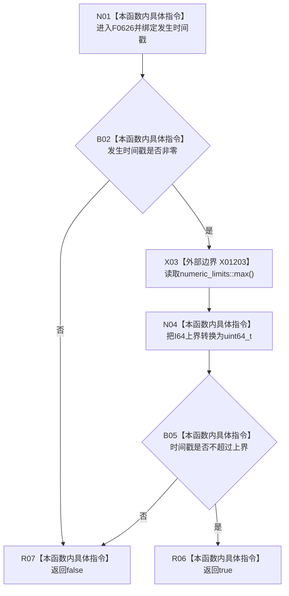

# CF-L7-0010 状态服务发生时间戳可用现状流程图

图类型：现状流程图
代码版本：`3920a74638264f9f539d50f32f3c9fe5fb1982ab`
源码 blob：`5b6bb9defda124496de99899621a9e4ab2dac179`
覆盖文件：`海中鱼巣/领域/状态服务.h:291-294`
唯一根函数：F0626
完整签名：`bool 海中鱼巣::状态服务::发生时间戳可用(std::uint64_t 发生时间戳) const`
参数：无符号 64 位发生时间戳按值传入；隐式 const `this` 未被读取
返回结果：时间戳非零且不超过有符号 64 位最大值时返回 true，否则返回 false
已登记调用方：F0335 经 E1685
直接项目函数：无
外部边界：X01203 `std::numeric_limits<std::int64_t>::max()`
未解析项目调用：0
调用图：`流程图/主程序可达调用关系/01_main可达项目调用边表.md`
逐行映射表：`流程图/代码流程图/L7/CF-L7-0010_状态服务发生时间戳可用_逐行代码映射表.md`
偏差清单：无
结构读取与写入：无
逻辑内返回：零值或超过 I64 上界时返回 false
内部错误：强前置已经保证范围却返回 false 时需追查调用间数据漂移
生命周期与资源释放：仅值参数和常量表达式，无资源持有
异常：X01203 为 `noexcept` 常量边界；无显式异常路径
并发 / 幂等：纯值判断，无共享状态；幂等
验证输出：291—294 行完整映射；1 条项目入边、0 条项目出边、1 个外部边界、0 个未解析调用
不得作为施工许可：是
不得宣称：该数值通过即可证明时间语义正确、单调、已持久化或可用于其它时间域

## 流程图

## 外部边界合同

| 稳定 ID | 目标 | 条件 | 结果 |
| --- | --- | --- | --- |
| X01203 | `std::numeric_limits<std::int64_t>::max()` | 发生时间戳非零 | I64 最大值，随后转为 uint64_t |

## 当前边界

- 第 292—293 行按 `&&` 短路；零值时不需要求上界。
- 上界允许 `INT64_MAX` 本身，不允许 `INT64_MAX + 1`。
- 函数不读取服务成员，不验证时间顺序、纪元或来源。
