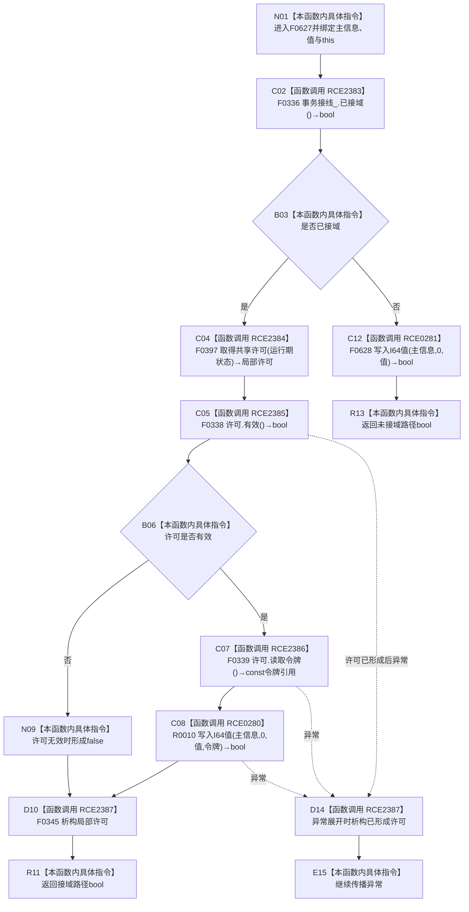

# CF-L7-0011 主信息仓库写入I64值无索引重载现状流程图

图类型：现状流程图
代码版本：`3920a74638264f9f539d50f32f3c9fe5fb1982ab`
源码 blob：`11f8fa53ff961a8cbaac34cf75b69a22533ca907`
覆盖文件：`海中鱼巣/核心/主信息仓库.cpp:375-381`
唯一根函数：F0627
完整签名：`bool 海中鱼巣::主信息仓库::写入I64值(海中鱼巣::主信息句柄 主信息, std::int64_t 值)`
参数：主信息句柄和 I64 值按值传入；隐式 `this` 为非拥有借用
返回结果：接域时取得共享许可并委托四参数令牌重载写入 0 号槽；许可无效返回 false；未接域时委托三参数带索引重载写入 0 号槽
已登记调用方：F0335 经 E1687
直接项目函数：RCE2383→F0336、RCE2384→F0397、RCE2385→F0338、RCE2386→F0339、RCE0280→R0010、RCE2387→F0345、RCE0281→F0628
外部边界：无
未解析项目调用：0；取得共享许可函数指针按当前生产接线唯一解析到 F0397
调用图：`流程图/主程序可达调用关系/01_main可达项目调用边表.md`
逐行映射表：`流程图/代码流程图/L7/CF-L7-0011_主信息仓库写入I64值无索引重载_逐行代码映射表.md`
偏差清单：无；本函数仍保留接域与未接域双路径
结构读取与写入：根函数不直接操作容器；固定把值索引 0 传给被调重载
逻辑内返回：许可无效或被调重载拒绝时返回 false
内部错误：上层已经证明句柄、许可和槽位有效而被调仍返回 false
生命周期与资源释放：接域路径局部许可在返回值形成后或异常展开时经 RCE2387 析构
异常：未捕获；许可取得、令牌读取或被调写入异常直接传播，已形成许可时先析构
并发 / 幂等：接域路径通过共享许可协调结构事务，再由 R0010 写入；重复同值写入结果上幂等，但调用本身不是事务幂等协议
验证输出：375—381 行完整映射；1 条项目入边、7 条项目出边、0 个外部边界、0 个未解析调用
不得作为施工许可：是
不得宣称：false 唯一表示句柄无效、共享许可等同独占事务或值已经进入类型化状态事实

## 流程图

## 项目源码调用合同

| 稳定 ID | 目标 | 实参 / 条件 | 结果 |
| --- | --- | --- | --- |
| RCE2383 | F0336 `已接域` | `this=&事务接线_`；入口 | bool 分支 |
| RCE2384 | F0397 共享许可函数对象 | `事务接线_.运行期状态`；已接域 | 局部许可 |
| RCE2385 | F0338 `许可.有效` | `this=&许可` | bool 短路 |
| RCE2386 | F0339 `许可.读取令牌` | `this=&许可`；许可有效 | const 令牌引用 |
| RCE0280 | R0010 四参数重载 | `this,主信息,0,值,RCE2386结果` | 写入 bool |
| RCE2387 | F0345 许可析构 | `this=&许可`；正常或异常退出 | void |
| RCE0281 | F0628 三参数重载 | `this,主信息,0,值`；未接域 | 写入 bool |

## 当前边界

- 第 378 行按 `&&` 短路；许可无效时不读取令牌、不调用 R0010。
- 根函数固定值索引为 0，不直接验证句柄或扩容值容器。
- RCE2387 只覆盖接域路径；未接域路径没有局部许可。
