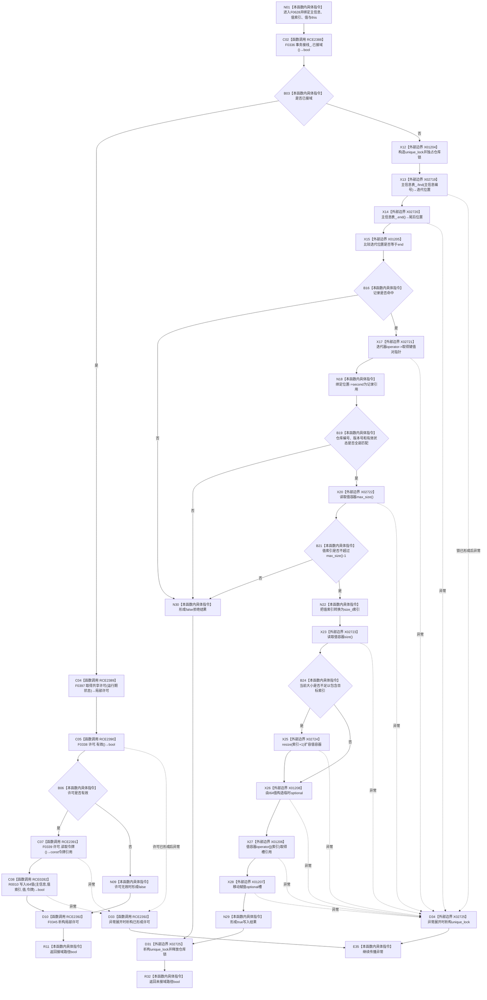

# CF-L7-0012 主信息仓库写入I64值带索引重载现状流程图

图类型：现状流程图
代码版本：`3920a74638264f9f539d50f32f3c9fe5fb1982ab`
源码 blob：`11f8fa53ff961a8cbaac34cf75b69a22533ca907`
覆盖文件：`海中鱼巣/核心/主信息仓库.cpp:383-406`
唯一根函数：F0628
完整签名：`bool 海中鱼巣::主信息仓库::写入I64值(海中鱼巣::主信息句柄 主信息, std::uint64_t 值索引, std::int64_t 值)`
参数：主信息句柄、无符号值索引和 I64 值按值传入；隐式 `this` 为非拥有借用
返回结果：接域时在共享许可下委托令牌重载；未接域时独占仓库锁，验证记录和句柄，按需扩容值容器并写入目标槽
已登记调用方：F0335 经 E1689；F0627 经 RCE0281
直接项目函数：RCE2388→F0336、RCE2389→F0397、RCE2390→F0338、RCE2391→F0339、RCE0282→R0010、RCE2392→F0345
外部边界：X01204 构造 `unique_lock`；X02719 `find`；X02720 `end`；X01205 `unordered_map` 迭代器比较；X02721 迭代器 `operator->`；X02722 `vector::max_size`；X02723 `vector::size`；X02724 `vector::resize`；X01206 `vector::operator[]`；X01208 构造 optional；X01207 optional 移动赋值；X02725 析构 `unique_lock`
未解析项目调用：0；取得共享许可函数指针按当前生产接线唯一解析到 F0397
调用图：`流程图/主程序可达调用关系/01_main可达项目调用边表.md`
逐行映射表：`流程图/代码流程图/L7/CF-L7-0012_主信息仓库写入I64值带索引重载_逐行代码映射表.md`
偏差清单：无；X01205 已按当前 `unordered_map` 实际类型校正，不再使用旧 `_List_const_iterator` 描述
结构读取与写入：接域根路径委托 R0010；未接域路径可能扩容 `值容器` 并覆盖目标 optional 槽
逻辑内返回：许可无效、记录不命中、句柄代次不匹配、记录非有效或索引超过 `max_size()-1` 时返回 false
内部错误：强前置成立但仍拒绝；`resize` 或 optional 写入异常导致可能已扩容但没有结构化回滚
生命周期与资源释放：接域许可经 RCE2392 析构；未接域独占锁经 X02725 在全部返回或异常路径释放
异常：许可取得、锁构造、容器查找、扩容或 optional 赋值异常向上传播；已形成的 RAII 对象先析构
并发 / 幂等：未接域路径在独占锁内完成验证、扩容和写入；相同值重复写入结果上幂等，但无版本递增或事务幂等身份
验证输出：383—406 行完整映射；2 条项目入边、6 条项目出边、12 个外部边界、0 个未解析调用
不得作为施工许可：是
不得宣称：false 能唯一定位原因、扩容与写入具备强异常回滚、共享许可等同独占事务或值槽是正式业务类型事实

## 流程图

## 项目源码调用合同

| 稳定 ID | 目标 | 实参 / 条件 | 结果 |
| --- | --- | --- | --- |
| RCE2388 | F0336 `已接域` | `this=&事务接线_`；入口 | bool 分支 |
| RCE2389 | F0397 共享许可函数对象 | `事务接线_.运行期状态`；已接域 | 局部许可 |
| RCE2390 | F0338 `许可.有效` | `this=&许可` | bool 短路 |
| RCE2391 | F0339 `许可.读取令牌` | `this=&许可`；许可有效 | const 令牌引用 |
| RCE0282 | R0010 四参数重载 | `this,主信息,值索引,值,RCE2391结果` | 写入 bool |
| RCE2392 | F0345 许可析构 | `this=&许可`；正常或异常退出 | void |

## 未接域外部边界合同

| 稳定 ID | 调用位置 | 当前作用 |
| --- | --- | --- |
| X01204 | 388 | 构造独占锁 |
| X02719 | 389 | 按主信息编号查找 |
| X02720 / X01205 | 390 | 取得尾后位置并比较是否未命中 |
| X02721 | 393 | 解引用迭代器并取得记录 |
| X02722 | 397 | 取得可容纳的最大元素数 |
| X02723 | 401 | 取得当前元素数 |
| X02724 | 402 | 按需扩容到 `索引+1` |
| X01208 / X01206 / X01207 | 404 | 构造 optional、取得槽引用并移动赋值 |
| X02725 | 388—405 | 所有正常、拒绝或异常路径释放独占锁 |

## 当前边界

- 值索引上界检查避免 `索引+1` 在容器规格范围内溢出；转换发生在检查之后。
- `resize` 成功而第 404 行赋值抛出时，扩容结果可能保留，本函数没有撤销。
- 写入不递增主信息版本号；旧句柄版本在值变化后保持不变。
