# CF-L7-0013 语素初始化服务初始化基础显示语素现状流程图

图类型：现状流程图
代码版本：`3920a74638264f9f539d50f32f3c9fe5fb1982ab`
源码 blob：`ba08c07c9863ba369a9b2a782a323ea5b5d206a5`
覆盖文件：`海中鱼巣/领域/初始化.语素.ixx:144-169`
唯一根函数：F0633
完整签名：`海中鱼巣::语素初始化结果 海中鱼巣::语素初始化服务::初始化基础显示语素()`
参数：无显式参数；隐式 `this` 为调用期间有效的非拥有借用
返回结果：18 个基础显示语素全部创建成功时返回完整 `语素初始化结果`；否则清理已形成结果并返回值初始化空结果
已登记调用方：F0349
直接项目函数：RCE0287→R0241 `创建显示项`（18 次）；RCE2393→F0173 `语素初始化结果::成功`；RCE0288→R0246 `清理初始化结果`
外部边界：X02728 宽字符串字面量隐式构造 `std::basic_string_view<wchar_t>`（18 次）
未解析项目调用：0
调用图：`流程图/主程序可达调用关系/01_main可达项目调用边表.md`
逐行映射表：`流程图/代码流程图/L7/CF-L7-0013_语素初始化服务初始化基础显示语素_逐行代码映射表.md`
偏差清单：无；遗漏的成功检查项目边及字符串视图边界已稳定登记
依据提交 / 结构化消息：当前源码、RCE0287、RCE0288、RCE2393、X02728 与函数身份表交叉复核
结构读取与写入：通过 R0241 创建并接线显示语素；失败路径通过 R0246 清理结果承载的已创建结构
逻辑内返回：当前代码在结果不完整时清理后返回空结果
内部错误：18 项创建完成后的“不成功”属于内部初始化结果异常，应作为追根因对象；异常不包装为空结果
生命周期与资源释放：局部结果按值返回；失败路径先清理其承载，再返回空结果
异常：任一构造或被调函数异常直接传播，当前函数不主动清理异常前已创建项
并发 / 幂等：本函数执行创建与清理，不是只读或天然幂等入口
验证输出：144—169 行完整映射；3 个项目出边 ID、1 个外部边界 ID（18 次）、0 个未解析调用
不得作为施工许可：是
不得宣称：空结果是正常候选、异常路径已回滚或初始化能力已经验证完成

## 流程图

```mermaid
flowchart TD
    N01["N01【本函数内具体指令】进入F0633并默认构造局部结果"]
    X02["X02【外部边界 X02728】由L“节点”构造wstring_view"]
    C03["C03【函数调用 RCE0287】R0241创建显示项(“节点”)→通用节点名称"]
    X04["X04【外部边界 X02728】由L“世界”构造wstring_view"]
    C05["C05【函数调用 RCE0287】R0241创建显示项(“世界”)→世界名称"]
    X06["X06【外部边界 X02728】由L“场景”构造wstring_view"]
    C07["C07【函数调用 RCE0287】R0241创建显示项(“场景”)→场景名称"]
    X08["X08【外部边界 X02728】由L“自我”构造wstring_view"]
    C09["C09【函数调用 RCE0287】R0241创建显示项(“自我”)→自我名称"]
    X10["X10【外部边界 X02728】由L“未知”构造wstring_view"]
    C11["C11【函数调用 RCE0287】R0241创建显示项(“未知”)→未知类型"]
    X12["X12【外部边界 X02728】由L“语素”构造wstring_view"]
    C13["C13【函数调用 RCE0287】R0241创建显示项(“语素”)→语素类型"]
    X14["X14【外部边界 X02728】由L“基础”构造wstring_view"]
    C15["C15【函数调用 RCE0287】R0241创建显示项(“基础”)→基础信息类型"]
    X16["X16【外部边界 X02728】由L“存在”构造wstring_view"]
    C17["C17【函数调用 RCE0287】R0241创建显示项(“存在”)→存在类型"]
    X18["X18【外部边界 X02728】由L“场景”构造wstring_view"]
    C19["C19【函数调用 RCE0287】R0241创建显示项(“场景”)→场景类型"]
    X20["X20【外部边界 X02728】由L“特征”构造wstring_view"]
    C21["C21【函数调用 RCE0287】R0241创建显示项(“特征”)→特征类型"]
    X22["X22【外部边界 X02728】由L“值”构造wstring_view"]
    C23["C23【函数调用 RCE0287】R0241创建显示项(“值”)→值类型"]
    X24["X24【外部边界 X02728】由L“需求”构造wstring_view"]
    C25["C25【函数调用 RCE0287】R0241创建显示项(“需求”)→需求类型"]
    X26["X26【外部边界 X02728】由L“任务”构造wstring_view"]
    C27["C27【函数调用 RCE0287】R0241创建显示项(“任务”)→任务类型"]
    X28["X28【外部边界 X02728】由L“方法”构造wstring_view"]
    C29["C29【函数调用 RCE0287】R0241创建显示项(“方法”)→方法类型"]
    X30["X30【外部边界 X02728】由L“动态”构造wstring_view"]
    C31["C31【函数调用 RCE0287】R0241创建显示项(“动态”)→动态类型"]
    X32["X32【外部边界 X02728】由L“因果”构造wstring_view"]
    C33["C33【函数调用 RCE0287】R0241创建显示项(“因果”)→因果引用类型"]
    X34["X34【外部边界 X02728】由L“状态”构造wstring_view"]
    C35["C35【函数调用 RCE0287】R0241创建显示项(“状态”)→状态类型"]
    X36["X36【外部边界 X02728】由L“二次”构造wstring_view"]
    C37["C37【函数调用 RCE0287】R0241创建显示项(“二次”)→二次类型"]
    C38["C38【函数调用 RCE2393】F0173结果.成功()→bool"]
    B39{"B39【本函数内具体指令】结果是否成功"}
    C40["C40【函数调用 RCE0288】R0246清理初始化结果(结果)"]
    R41["R41【本函数内具体指令】返回值初始化空结果"]
    R42["R42【本函数内具体指令】按值返回完整结果"]

    N01 --> X02 --> C03 --> X04 --> C05 --> X06 --> C07 --> X08 --> C09
    C09 --> X10 --> C11 --> X12 --> C13 --> X14 --> C15 --> X16 --> C17
    C17 --> X18 --> C19 --> X20 --> C21 --> X22 --> C23 --> X24 --> C25
    C25 --> X26 --> C27 --> X28 --> C29 --> X30 --> C31 --> X32 --> C33
    C33 --> X34 --> C35 --> X36 --> C37 --> C38 --> B39
    B39 -- "否；内部初始化结果异常" --> C40 --> R41
    B39 -- "是" --> R42
```

## 项目源码调用合同

| 调用边 | 被调函数 | 实参 / 条件 | 结果用途 |
| --- | --- | --- | --- |
| RCE0287 | R0241 `创建显示项(std::wstring_view)` | X02728 依次形成“节点、世界、场景、自我、未知、语素、基础、存在、场景、特征、值、需求、任务、方法、动态、因果、状态、二次”；共 18 次 | 分别写入结果的 18 个显示项字段 |
| RCE2393 | F0173 `语素初始化结果::成功() const` | `this=&结果` | 决定返回完整结果或清理 |
| RCE0288 | R0246 `清理初始化结果` | `结果`；仅成功检查为假 | 清理已形成的显示语素及其关系 |

## 当前边界

- X02728 和 RCE0287 各有 18 个调用点；图中按源码顺序逐次展开，没有把不同文本与结果字段混为一项。
- 第 164 行检查发生在全部 18 次创建之后；失败分支先清理再返回空结果。
- 当前代码未为创建期间抛出的异常设置局部清理保护，本图不把异常路径伪写为已回滚。
