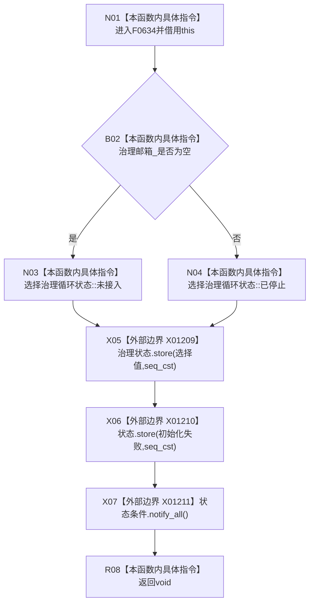

# CF-L7-0014 自我线程标记初始化失败现状流程图

图类型：现状流程图
代码版本：`3920a74638264f9f539d50f32f3c9fe5fb1982ab`
源码 blob：`33a355deebc02a2d9eb370a5003312415125210c`
覆盖文件：`海中鱼巣/线程/自我线程.ixx:438-444`
唯一根函数：F0634
完整签名：`void 海中鱼巣::自我线程::标记初始化失败()`
参数：无显式参数；隐式 `this` 为调用期间有效的独占对象借用
返回结果：`void`；按治理邮箱是否存在写治理循环状态，写入初始化失败状态并唤醒全部等待方
已登记调用方：F0349
直接项目函数：无
外部边界：X01209 治理状态原子写入；X01210 自我线程状态原子写入；X01211 条件变量 `notify_all`
未解析项目调用：0
调用图：`流程图/主程序可达调用关系/01_main可达项目调用边表.md`
逐行映射表：`流程图/代码流程图/L7/CF-L7-0014_自我线程标记初始化失败_逐行代码映射表.md`
偏差清单：无
依据提交 / 结构化消息：当前源码与 X01209—X01211 交叉复核
结构读取与写入：读取治理邮箱指针；写两项原子状态并发出条件变量通知
逻辑内返回：无分支返回；治理邮箱为空时写 `未接入`，否则写 `已停止`
内部错误：三个外部边界均为 `noexcept`
生命周期与资源释放：不取得或释放资源
异常：无显式异常路径
并发 / 幂等：原子写入使用默认顺序一致性；重复调用会重复写同值并再次通知
验证输出：438—444 行完整映射；0 个项目出边、3 个外部边界、0 个未解析调用
不得作为施工许可：是
不得宣称：等待方已完成处理、治理循环真实启动过或初始化失败根因已解决

## 流程图

## 外部边界合同

| 边界 | 调用 | 输入 / 条件 | 结果用途 |
| --- | --- | --- | --- |
| X01209 | `atomic<自我线程治理循环状态>::store` | 邮箱为空选 `未接入`，否则选 `已停止`；默认 `seq_cst` | 发布治理循环终止状态 |
| X01210 | `atomic<自我线程状态>::store` | 固定写 `初始化失败`；默认 `seq_cst` | 发布线程初始化结果 |
| X01211 | `condition_variable::notify_all` | 两项状态写入之后 | 唤醒全部状态等待方 |

## 当前边界

- 治理邮箱只参与选择写入值，不发生解引用。
- 通知是同步信号，不证明任何等待方已经观察、处理或完成恢复。
