# CF-L7-0015 世界树初始化服务初始化自我世界树现状流程图

图类型：现状流程图
代码版本：`3920a74638264f9f539d50f32f3c9fe5fb1982ab`
源码 blob：`77edcb28282c0ec33e7c695e063b1605e4fb37bf`
覆盖文件：`海中鱼巣/领域/初始化.世界树.ixx:50-86`
唯一根函数：F0635
完整签名：`海中鱼巣::世界树初始化结果 海中鱼巣::世界树初始化服务::初始化自我世界树()`
参数：无显式参数；隐式 `this` 为调用期间有效的非拥有借用
返回结果：创建根节点、场景、自我存在节点、三条关系与零点相对坐标，完成读回和关系存在性核对后返回结果；任一当前检查失败均清理并返回值初始化空结果
已登记调用方：F0349
直接项目函数：RCE2394→R0733 `世界服务::创建基础信息`；RCE2395→R0734 `世界服务::创建场景`；RCE0289→R0203 `世界服务::创建存在`；RCE2396→R0735 `节点类型匹配`；RCE0290→R0275 `场景是否有效`；RCE0291→R0277 `存在是否有效`；RCE0292→R0225 `清理初始化结果`（3 次）；RCE2397→F0167 `创建关系`（2 次）；RCE2398→R0736 `世界服务::接纳存在`；RCE0293→F0168 `句柄有效`（3 次）；RCE0294→R0223 `写入自我相对坐标零点`；RCE0295→F0059 `读取自我相对坐标`；RCE2399→F0579 `存在关系`（3 次）
外部边界：X02729 `optional<世界树相对坐标>::has_value`；X02730 `optional<世界树相对坐标>::operator->`（3 次）；X02731 `optional<世界树相对坐标>::value`
未解析项目调用：0
调用图：`流程图/主程序可达调用关系/01_main可达项目调用边表.md`
逐行映射表：`流程图/代码流程图/L7/CF-L7-0015_世界树初始化服务初始化自我世界树_逐行代码映射表.md`
偏差清单：无；四项直接函数身份、六条项目边及三个 optional 边界已稳定登记
依据提交 / 结构化消息：当前源码、RCE0289—RCE0295、RCE2394—RCE2399、X02729—X02731 与函数身份表交叉复核
结构读取与写入：通过被调函数创建节点、关系与三项坐标主信息；三处失败路径调用 R0225 清理已形成结果；本函数最终只保存读回坐标到返回结果
逻辑内返回：当前代码把任一检查失败清理后返回空结果
内部错误：创建前置通过后的类型、句柄、坐标或关系读回异常属于内部初始化结果异常，应作为追根因对象
生命周期与资源释放：局部结果和坐标 `optional` 按值管理；失败路径显式清理结果承载结构
异常：被调函数或 `optional::value` 异常直接传播；当前函数未为异常路径设置显式清理保护
并发 / 幂等：执行真实创建、写入、读回与可能清理，不是只读或天然幂等入口
验证输出：50—86 行完整映射；13 个项目出边 ID、3 个外部边界 ID、0 个未解析调用
不得作为施工许可：是
不得宣称：空结果是正常候选、异常路径已回滚、所有清理均成功或世界树初始化能力已通过运行验证

## 流程图

```mermaid
flowchart TD
    N01["N01【本函数内具体指令】进入F0635并默认构造局部初始化结果"]
    C02["C02【函数调用 RCE2394】R0733世界_.创建基础信息()→世界树根节点"]
    C03["C03【函数调用 RCE2395】R0734世界_.创建场景()→自我所在场景"]
    C04["C04【函数调用 RCE0289】R0203世界_.创建存在()→自我存在节点"]
    C05["C05【函数调用 RCE2396】R0735节点类型匹配(根节点,基础信息)→bool"]
    B06{"B06【本函数内具体指令】根节点类型与主信息是否有效"}
    C07["C07【函数调用 RCE0290】R0275场景是否有效(自我所在场景)→bool"]
    B08{"B08【本函数内具体指令】场景是否有效"}
    C09["C09【函数调用 RCE0291】R0277存在是否有效(自我存在节点)→bool"]
    B10{"B10【本函数内具体指令】存在节点是否有效"}
    C11["C11【函数调用 RCE0292】R0225清理初始化结果(结果)"]
    R12["R12【本函数内具体指令】返回值初始化空结果"]
    C13["C13【函数调用 RCE2397】F0167创建普通父子关系(根节点,场景)→根到场景关系"]
    C14["C14【函数调用 RCE2397】F0167创建普通父子关系(场景,自我)→场景到自我父子关系"]
    C15["C15【函数调用 RCE2398】R0736世界_.接纳存在(场景,自我)→场景接纳自我关系"]
    C16["C16【函数调用 RCE0293】F0168句柄有效(根到场景关系)→bool"]
    B17{"B17【本函数内具体指令】根到场景关系是否有效"}
    C18["C18【函数调用 RCE0293】F0168句柄有效(场景到自我父子关系)→bool"]
    B19{"B19【本函数内具体指令】场景到自我父子关系是否有效"}
    C20["C20【函数调用 RCE0293】F0168句柄有效(场景接纳自我关系)→bool"]
    B21{"B21【本函数内具体指令】场景接纳自我关系是否有效"}
    C22["C22【函数调用 RCE0294】R0223写入自我相对坐标零点(自我存在节点)→bool"]
    B23{"B23【本函数内具体指令】零点写入是否成功"}
    C24["C24【函数调用 RCE0292】R0225清理初始化结果(结果)"]
    R25["R25【本函数内具体指令】返回值初始化空结果"]
    C26["C26【函数调用 RCE0295】F0059读取自我相对坐标(自我存在节点)→optional坐标"]
    X27["X27【外部边界 X02729】坐标.has_value()→bool"]
    B28{"B28【本函数内具体指令】坐标是否有值"}
    X29["X29【外部边界 X02730】坐标.operator->()读取横向"]
    B30{"B30【本函数内具体指令】横向是否等于0.0"}
    X31["X31【外部边界 X02730】坐标.operator->()读取纵向"]
    B32{"B32【本函数内具体指令】纵向是否等于0.0"}
    X33["X33【外部边界 X02730】坐标.operator->()读取垂向"]
    B34{"B34【本函数内具体指令】垂向是否等于0.0"}
    C35["C35【函数调用 RCE2399】F0579存在普通父子关系(根节点,场景)→bool"]
    B36{"B36【本函数内具体指令】根到场景关系是否可读"}
    C37["C37【函数调用 RCE2399】F0579存在普通父子关系(场景,自我)→bool"]
    B38{"B38【本函数内具体指令】场景到自我父子关系是否可读"}
    C39["C39【函数调用 RCE2399】F0579存在归属关系(场景,自我)→bool"]
    B40{"B40【本函数内具体指令】场景接纳自我关系是否可读"}
    C41["C41【函数调用 RCE0292】R0225清理初始化结果(结果)"]
    R42["R42【本函数内具体指令】返回值初始化空结果"]
    X43["X43【外部边界 X02731】坐标.value()→const坐标引用"]
    N44["N44【本函数内具体指令】复制读回坐标到结果.自我相对坐标"]
    R45["R45【本函数内具体指令】按值返回完整初始化结果"]

    N01 --> C02 --> C03 --> C04 --> C05 --> B06
    B06 -- "否；内部初始化结果异常" --> C11 --> R12
    B06 -- "是" --> C07 --> B08
    B08 -- "否；内部初始化结果异常" --> C11
    B08 -- "是" --> C09 --> B10
    B10 -- "否；内部初始化结果异常" --> C11
    B10 -- "是" --> C13 --> C14 --> C15 --> C16 --> B17
    B17 -- "否；内部初始化结果异常" --> C24 --> R25
    B17 -- "是" --> C18 --> B19
    B19 -- "否；内部初始化结果异常" --> C24
    B19 -- "是" --> C20 --> B21
    B21 -- "否；内部初始化结果异常" --> C24
    B21 -- "是" --> C22 --> B23
    B23 -- "否；内部初始化结果异常" --> C24
    B23 -- "是" --> C26 --> X27 --> B28
    B28 -- "否；内部读回异常" --> C41 --> R42
    B28 -- "是" --> X29 --> B30
    B30 -- "否；坐标非零" --> C41
    B30 -- "是" --> X31 --> B32
    B32 -- "否；坐标非零" --> C41
    B32 -- "是" --> X33 --> B34
    B34 -- "否；坐标非零" --> C41
    B34 -- "是" --> C35 --> B36
    B36 -- "否；关系读回异常" --> C41
    B36 -- "是" --> C37 --> B38
    B38 -- "否；关系读回异常" --> C41
    B38 -- "是" --> C39 --> B40
    B40 -- "否；关系读回异常" --> C41
    B40 -- "是" --> X43 --> N44 --> R45
```

## 项目源码调用合同

| 调用边 | 被调函数 | 实参 / 条件 | 结果用途 |
| --- | --- | --- | --- |
| RCE2394 / RCE2395 / RCE0289 | R0733 `创建基础信息`、R0734 `创建场景`、R0203 `创建存在` | `this=&世界_` | 依次写入三个节点字段 |
| RCE2396 / RCE0290 / RCE0291 | R0735 `节点类型匹配`、R0275 `场景是否有效`、R0277 `存在是否有效` | 三个已创建节点 | 入口创建结果短路检查 |
| RCE2397 | F0167 四参数 `创建关系` | 关系类型为普通父子；根→场景、场景→自我；顺序号使用声明默认值 | 写入两条普通父子关系句柄 |
| RCE2398 | R0736 `世界服务::接纳存在` | 场景、自我存在节点 | 写入场景接纳自我关系句柄 |
| RCE0293 | F0168 关系句柄 `句柄有效` | 三个关系句柄；短路顺序 | 决定是否继续写坐标 |
| RCE0294 | R0223 `写入自我相对坐标零点` | 自我存在节点 | 写入三轴零点并返回整体成功 |
| RCE0295 | F0059 `读取自我相对坐标` | 自我存在节点 | 形成待核坐标 `optional` |
| RCE2399 | F0579 `存在关系` | 普通父子根→场景、普通父子场景→自我、归属场景→自我 | 读回核对三条关系 |
| RCE0292 | R0225 `清理初始化结果` | 任一三阶段短路检查失败后的当前结果 | 清理已形成的节点、关系与主信息 |

## 当前边界

- 三组检查都按 `||` 短路；只有前项通过才调用后续检查函数或 `optional::operator->`。
- X02730 聚合第 75—77 行三次 `operator->` 调用，分别读取横向、纵向、垂向。
- X02731 只在 `has_value`、三轴零值和三条关系存在检查全部通过后调用。
- 当前显式清理只覆盖返回空结果的三个分支；被调函数抛出异常时本函数不会转入 R0225。
