# CF-L7-0016 需求初始化服务初始化两个根需求现状流程图

图类型：现状流程图
代码版本：`37feabb47bf83e25f33ce1e86fddd1b041c2c658`
源码事实提交：`3920a74638264f9f539d50f32f3c9fe5fb1982ab`
源码 blob：`8b2bd4e4d44b747d661d82401db6aea5901c67da`
覆盖文件：`海中鱼巣/领域/初始化.需求.ixx:73-112`
唯一根函数：F0636
完整签名：`海中鱼巣::自我根需求初始化结果 海中鱼巣::需求初始化服务::初始化两个根需求(const 海中鱼巣::世界树初始化结果& 世界树结果, const 海中鱼巣::自我根需求初始化参数& 参数)`
参数：世界树结果和参数均为调用期间有效的 const 左值引用；隐式 `this` 为非拥有借用
返回结果：依次初始化安全根需求、服务根需求和共享概念命名目标状态，全部读回检查通过时返回完整结果；任一前置或内部检查失败时返回默认空结果
已登记调用方：F0349 经 E1839
直接项目函数：RCE2374→F0174、RCE0299→F0134、RCE0300→R0249、RCE2375→F0350、RCE2376→F0165、RCE2377→F0329、RCE0296→F0184、RCE0297→F0163、RCE0298→F0328
外部边界：X02712 两次构造 `std::basic_string_view<wchar_t>`；X02713 构造 `std::optional<std::int64_t>`；X01230 比较两个 optional
未解析项目调用：0
调用图：`流程图/主程序可达调用关系/01_main可达项目调用边表.md`
逐行映射表：`流程图/代码流程图/L7/CF-L7-0016_需求初始化服务初始化两个根需求_逐行代码映射表.md`
偏差清单：RCE0299 已收窄为参数有效检查；RCE0297 已校正为节点句柄重载
依据提交 / 结构化消息：冻结基线、当前源码、E1839、RCE0296—RCE0300、RCE2374—RCE2377、X01230、X02712—X02713 交叉复核
结构读取与写入：被调初始化与状态服务可能创建节点及相关结构；本函数保存返回句柄并执行读回检查
逻辑内返回：入口材料无效时在任何本函数发起的创建前返回空结果
内部错误：任一单根需求初始化失败，或共享目标状态创建后的读回不符合内部预期，返回空结果；后者经追根因检查报告
生命周期与资源释放：结果按值返回；不保存输入引用
异常：未捕获；被调初始化、状态读写和外部构造异常向调用方传播
并发 / 幂等：本函数不自行建立总事务；重复调用可能再次触发被调创建，不能据函数名宣称幂等
验证输出：73—112 行完整映射；1 条项目入边、9 条项目出边、3 个外部边界 ID、0 个未解析调用
不得作为施工许可：是
不得宣称：成功返回等于完整系统初始化完成，或失败返回已撤销此前全部结构变化

## 流程图

```mermaid
flowchart TD
    N01["N01【本函数内具体指令】进入F0636并借用两个const输入与this"]
    C02["C02【函数调用 RCE2374】F0174 世界树结果.成功()→bool"]
    B03{"B03【本函数内具体指令】世界树结果是否成功"}
    C04["C04【函数调用 RCE0299】F0134 参数.有效()→bool"]
    B05{"B05【本函数内具体指令】参数是否有效"}
    RF["RF【本函数内具体指令】返回默认空结果"]
    N06["N06【本函数内具体指令】默认构造局部初始化结果"]
    X07["X07【外部边界 X02712】从L安全值构造wstring_view"]
    C08["C08【函数调用 RCE0300】R0249 初始化安全单根需求→结果"]
    N09["N09【本函数内具体指令】保存安全根需求结果"]
    C10["C10【函数调用 RCE2375】F0350 安全根需求.成功()→bool"]
    B11{"B11【本函数内具体指令】安全根需求是否成功"}
    X12["X12【外部边界 X02712】从L服务值构造wstring_view"]
    C13["C13【函数调用 RCE0300】R0249 初始化服务单根需求→结果"]
    N14["N14【本函数内具体指令】保存服务根需求结果"]
    C15["C15【函数调用 RCE2375】F0350 服务根需求.成功()→bool"]
    B16{"B16【本函数内具体指令】服务根需求是否成功"}
    C17["C17【函数调用 RCE2376】F0165 创建抽象状态(1)→节点句柄"]
    N18["N18【本函数内具体指令】保存概念命名目标状态句柄"]
    C19["C19【函数调用 RCE2377】F0329 读取状态值(目标状态)→optional值"]
    N20["N20【本函数内具体指令】保存目标状态读回值"]
    C21["C21【函数调用 RCE0297】F0163 句柄有效(目标状态)→bool"]
    X22["X22【外部边界 X02713】从整数1构造optional期望值"]
    X23["X23【外部边界 X01230】比较读回optional与期望optional→bool"]
    C24["C24【函数调用 RCE0298】F0328 状态是否实例状态(目标状态)→bool"]
    N25["N25【本函数内具体指令】合取句柄、值和非实例状态三项内部预期"]
    C26["C26【函数调用 RCE0296】F0184 追根因检查(条件,说明)→bool"]
    B27{"B27【本函数内具体指令】追根因检查是否通过"}
    RT["RT【本函数内具体指令】按值返回完整结果"]

    N01 --> C02 --> B03
    B03 -- "否" --> RF
    B03 -- "是" --> C04 --> B05
    B05 -- "否" --> RF
    B05 -- "是" --> N06 --> X07 --> C08 --> N09 --> C10 --> B11
    B11 -- "否" --> RF
    B11 -- "是" --> X12 --> C13 --> N14 --> C15 --> B16
    B16 -- "否" --> RF
    B16 -- "是" --> C17 --> N18 --> C19 --> N20 --> C21
    C21 --> X22 --> X23 --> C24 --> N25 --> C26 --> B27
    B27 -- "否" --> RF
    B27 -- "是" --> RT
```

## 当前边界

- RCE0300 聚合安全与服务两次单根初始化，实参分别绑定各自稳定键、当前值、目标值和共同世界树节点。
- 最终追根因条件按短路顺序检查句柄有效、读回值等于 1、目标状态不是实例状态。
- 安全根需求成功后服务初始化或共享状态检查仍可能失败；当前函数返回空结果，但没有本地撤销步骤。
