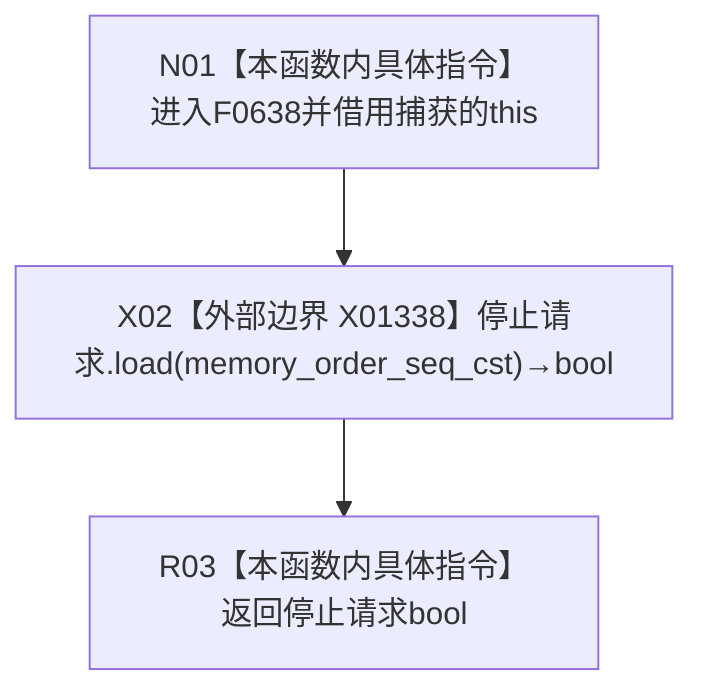

# CF-L7-0017 自我线程执行初始化 lambda 现状流程图

图类型：现状流程图
代码版本：`37feabb47bf83e25f33ce1e86fddd1b041c2c658`
源码事实提交：`3920a74638264f9f539d50f32f3c9fe5fb1982ab`
源码 blob：`33a355deebc02a2d9eb370a5003312415125210c`
覆盖文件：`海中鱼巣/线程/自我线程.ixx:343-345`
唯一根函数：F0638
完整签名：`bool 海中鱼巣::自我线程::执行初始化(const 海中鱼巣::自我根需求初始化参数&)::<lambda@自我线程.ixx:343-345>::operator()() const`
参数：无显式参数；闭包按指针捕获 `this`，调用期间要求自我线程对象有效
返回结果：以默认 `memory_order_seq_cst` 读取停止请求原子位并返回 bool
已登记调用方：F0349 经 E1843，作为条件变量 wait 谓词可重复调用
直接项目函数：无
外部边界：X01338 `std::atomic<bool>::load(memory_order_seq_cst)`
未解析项目调用：0
逐行映射表：`流程图/代码流程图/L7/CF-L7-0017_自我线程执行初始化lambda_逐行代码映射表.md`
结构读取与写入：只读停止请求原子位
逻辑内返回：停止请求为 false 时返回 false，条件变量继续等待
并发 / 幂等：原子顺序一致读取；每次结果取决于调用时状态
验证输出：343—345 行完整映射；1 条项目入边、0 条项目出边、1 个外部边界
不得作为施工许可：是
不得宣称：返回 true 证明线程已经停止或资源已经收口

## 流程图

## 当前边界

- E1843 的条件变量可能在首次检查和每次唤醒后重复调用本闭包。
- 本函数不修改停止请求、不解锁互斥量，也不改变线程状态。
