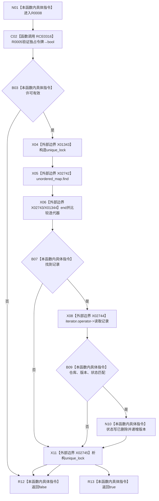

# CF-L7-0019 主信息仓库删除主信息带令牌重载现状流程图

图类型：现状流程图
代码版本：`3920a74638264f9f539d50f32f3c9fe5fb1982ab`
源码 blob：`11f8fa53ff961a8cbaac34cf75b69a22533ca907`
覆盖文件：`海中鱼巣/核心/主信息仓库.cpp:312-322`
唯一根函数：R0008
完整签名：`bool 海中鱼巣::主信息仓库::删除主信息(主信息句柄 主信息, const 结构事务令牌& 令牌)`
参数：主信息按值；令牌为 const 借用；隐式 `this` 为借用
返回结果：独占令牌、记录身份/版本/状态均有效并完成软删除时返回 `true`
已登记调用方：R0224、R0244、R0245、R0574
直接项目函数：RCE0316→R0005；RCE0315 已删除
外部边界：X01343—X01344、X02742—X02745
未解析项目调用：0
调用图：`流程图/主程序可达调用关系/01_main可达项目调用边表.md`
逐行映射表：`流程图/代码流程图/L7/CF-L7-0019_主信息仓库删除主信息带令牌重载_逐行代码映射表.md`
偏差清单：无
依据提交 / 结构化消息：当前源码、RCE0316、X01343—X01344、X02742—X02745
结构读取与写入：把有效记录状态写为已删除并递增版本
逻辑内返回：许可、记录或句柄不匹配返回 `false`
验证输出：312—322 行完整映射
不得作为施工许可：是
不得宣称：记录已物理擦除

## 流程图

## 当前边界

- X01344 为 `unordered_map` 迭代器比较；RCE0315 不对应任何当前源码调用。
