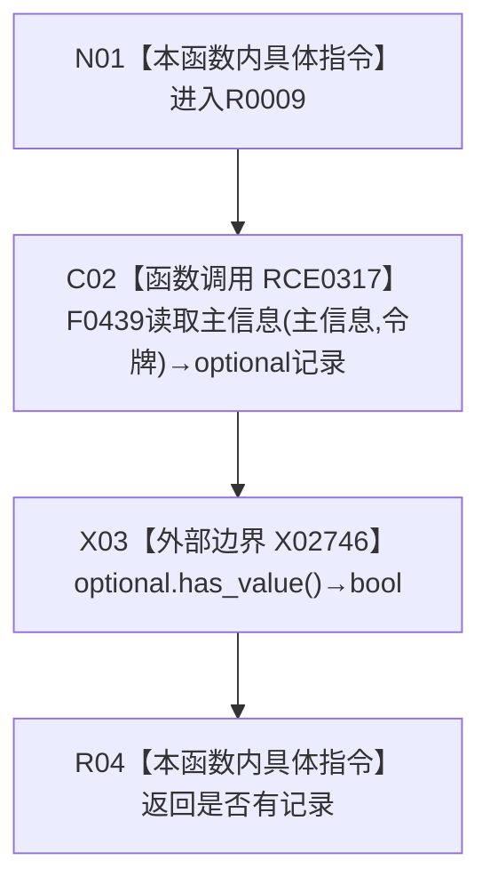

# CF-L7-0020 主信息仓库主信息是否有效带令牌重载现状流程图

图类型：现状流程图
代码版本：`3920a74638264f9f539d50f32f3c9fe5fb1982ab`
源码 blob：`11f8fa53ff961a8cbaac34cf75b69a22533ca907`
覆盖文件：`海中鱼巣/核心/主信息仓库.cpp:371-373`
唯一根函数：R0009
完整签名：`bool 海中鱼巣::主信息仓库::主信息是否有效(主信息句柄 主信息, const 结构事务令牌& 令牌) const`
参数：主信息按值；令牌与 const `this` 为非拥有借用
返回结果：带令牌读取结果 `optional` 是否有值
已登记调用方：F0623、F0624、R0206、R0242、R0731
直接项目函数：RCE0317→F0439
外部边界：X02746 `optional<主信息记录>::has_value`
未解析项目调用：0
调用图：`流程图/主程序可达调用关系/01_main可达项目调用边表.md`
逐行映射表：`流程图/代码流程图/L7/CF-L7-0020_主信息仓库主信息是否有效带令牌重载_逐行代码映射表.md`
偏差清单：无
依据提交 / 结构化消息：当前源码、RCE0317、X02746
结构读取与写入：只读主信息记录
逻辑内返回：无记录返回 `false`
验证输出：371—373 行完整映射
不得作为施工许可：是
不得宣称：`false` 证明句柄从未存在

## 流程图

