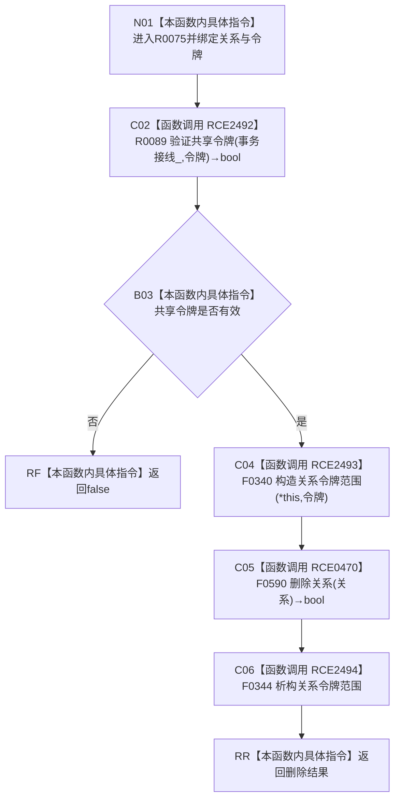

# CF-L7-0021 关系仓库删除关系令牌重载现状流程图

图类型：现状流程图
代码版本：`176b674a6c1499ccdd7306f30f910fec6dc5079c`
源码事实提交：`3920a74638264f9f539d50f32f3c9fe5fb1982ab`
源码 blob：`f7a9ea9a09d3065468208c16f9ea34f806b6e183`
覆盖文件：`海中鱼巣/核心/关系仓库.cpp:1446-1449`
唯一根函数：R0075
完整签名：`bool 海中鱼巣::关系仓库::删除关系(海中鱼巣::关系句柄 关系, const 海中鱼巣::结构事务令牌& 令牌)`
参数：关系句柄按值传入；令牌为 const 非拥有借用；隐式 `this` 为仓库借用
返回结果：共享令牌无效时返回 false；有效时在关系令牌语境中原样返回无令牌删除重载结果
已登记调用方：R0225/R0245/R0574，经 RCE0785/RCE0832/RCE1589
直接项目函数：RCE2492→R0089、RCE2493→F0340、RCE0470→F0590、RCE2494→F0344
外部边界：无
未解析项目调用：0
逐行映射表：`流程图/代码流程图/L7/CF-L7-0021_关系仓库删除关系令牌重载_逐行代码映射表.md`
结构读取与写入：令牌有效时 F0590 可能把关系状态改为已删除；本重载只建立和恢复线程局部令牌语境
验证输出：1446—1449 行完整映射；3 条项目入边、4 条项目出边、0 个外部边界
不得作为施工许可：是

## 流程图

## 当前边界

- RCE2492 返回 false 时不构造令牌范围且不调用 F0590。
- RCE2494 覆盖 RCE2493 构造后的正常、返回和异常退出；只恢复线程局部语境。
- 返回 false 不能单独区分共享令牌拒绝与 F0590 删除失败。
