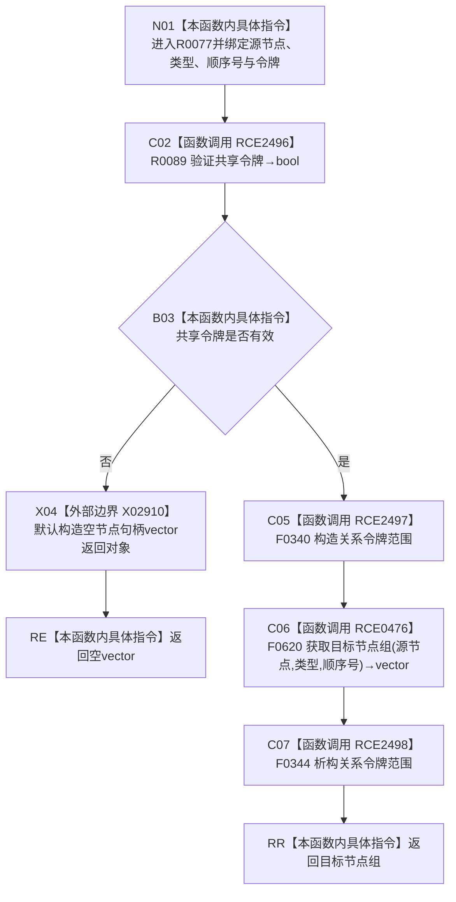

# CF-L7-0022 关系仓库获取目标节点组按顺序号令牌重载现状流程图

图类型：现状流程图
代码版本：`176b674a6c1499ccdd7306f30f910fec6dc5079c`
源码事实提交：`3920a74638264f9f539d50f32f3c9fe5fb1982ab`
源码 blob：`f7a9ea9a09d3065468208c16f9ea34f806b6e183`
覆盖文件：`海中鱼巣/核心/关系仓库.cpp:1542-1545`
唯一根函数：R0077
完整签名：`std::vector<海中鱼巣::节点句柄> 海中鱼巣::关系仓库::获取目标节点组(海中鱼巣::节点句柄 源节点, 海中鱼巣::关系类型 类型, std::int64_t 顺序号, const 海中鱼巣::结构事务令牌& 令牌) const`
参数：源节点、类型和顺序号按值传入；令牌与 const 仓库对象为非拥有借用
返回结果：共享令牌无效时返回空向量；有效时原样返回无令牌三参数重载结果
已登记调用方：R0204/R0576/R0577/R0581/R0595/R0597，经 RCE0743/RCE1593/RCE1594/RCE1607/RCE1627/RCE1632
直接项目函数：RCE2496→R0089、RCE2497→F0340、RCE0476→F0620、RCE2498→F0344
外部边界：X02910
未解析项目调用：0
逐行映射表：`流程图/代码流程图/L7/CF-L7-0022_关系仓库获取目标节点组按顺序号令牌重载_逐行代码映射表.md`
结构读取与写入：只建立线程局部令牌语境并读取目标节点投影，零持久结构变化
验证输出：1542—1545 行完整映射；6 条项目入边、4 条项目出边、1 个外部边界
不得作为施工许可：是

## 流程图

## 当前边界

- X02910 只在共享令牌验证失败时直接构造空返回向量。
- RCE2498 清理 RCE2497 建立的线程局部令牌语境；不验证返回节点持续有效。
