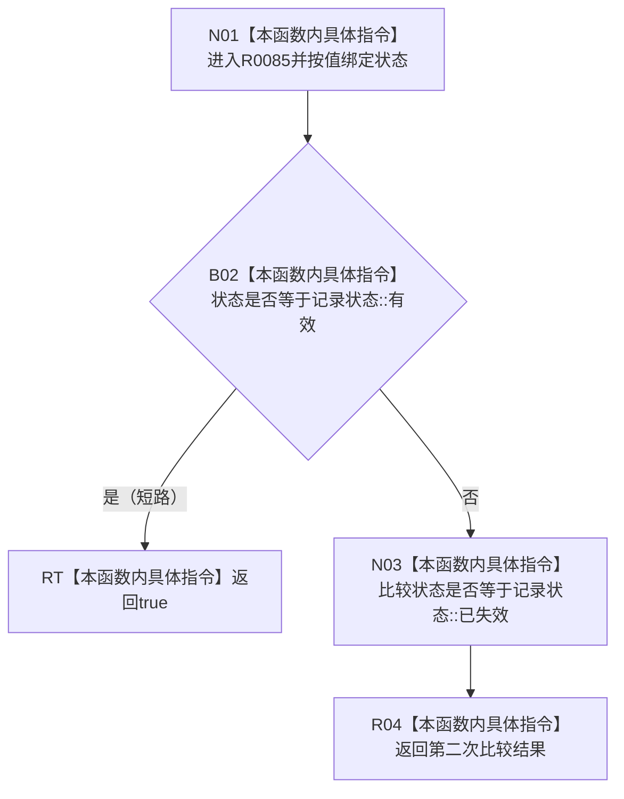

# CF-L7-0023 关系状态可审计现状流程图

图类型：现状流程图
代码版本：`7ad8cf5113162fe92b9f8d43f2b5b9f00d292d1a`
源码事实提交：`3920a74638264f9f539d50f32f3c9fe5fb1982ab`
源码 blob：`f7a9ea9a09d3065468208c16f9ea34f806b6e183`
覆盖文件：`海中鱼巣/核心/关系仓库.cpp:45-47`
唯一根函数：R0085
完整签名：`bool 海中鱼巣::{匿名命名空间@关系仓库.cpp}::关系状态可审计(海中鱼巣::记录状态 状态)`
参数：状态按值传入
返回结果：状态为有效或已失效时返回 true，其余状态返回 false
已登记调用方：F0582/F0589，经 RCE0269/RCE0271
直接项目函数：无
外部边界：无
未解析项目调用：0
逐行映射表：`流程图/代码流程图/L7/CF-L7-0023_关系状态可审计_逐行代码映射表.md`
结构读取与写入：只比较枚举值，零结构变化
验证输出：45—47 行完整映射；2 条项目入边、0 条项目出边、0 个外部边界
不得作为施工许可：是
不得宣称：可审计状态已经完成导出、恢复或持久化

## 流程图

## 当前边界

- `||` 保持短路语义；有效状态无需再比较已失效。
- 本函数只给出审计筛选判断，不读取或写入关系记录。
