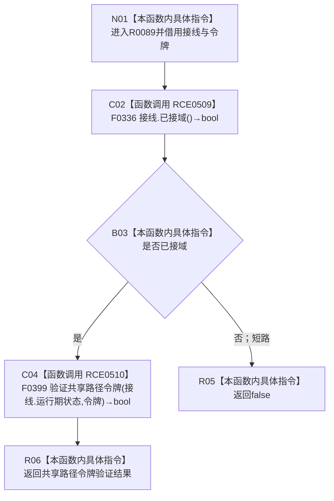

# CF-L7-0024 关系仓库验证共享令牌现状流程图

图类型：现状流程图
代码版本：`3920a74638264f9f539d50f32f3c9fe5fb1982ab`
源码 blob：`f7a9ea9a09d3065468208c16f9ea34f806b6e183`
覆盖文件：`海中鱼巣/核心/关系仓库.cpp:87-89`
唯一根函数：R0089
完整签名：`bool 海中鱼巣::{匿名命名空间@关系仓库.cpp}::验证共享令牌(const 海中鱼巣::结构事务接线& 接线, const 海中鱼巣::结构事务令牌& 令牌)`
参数：`接线`、`令牌` 均为调用期间有效的 const 非拥有借用
返回结果：未接域时短路返回 `false`；已接域时返回共享路径令牌验证结果
已登记调用方：RCE0423、RCE0462、RCE1760、RCE2489、RCE2492、RCE2496、RCE2499、RCE2502、RCE2505
直接项目函数：RCE0509→F0336；RCE0510→F0399
外部边界：无；未解析项目调用：0
调用图：`流程图/主程序可达调用关系/01_main可达项目调用边表.md`
逐行映射表：`流程图/代码流程图/L7/CF-L7-0024_关系仓库验证共享令牌_逐行代码映射表.md`
偏差清单：无；本图只记录当前代码事实
依据提交 / 结构化消息：当前源码与上述稳定项目边
结构读取与写入：只读接线域状态、运行期状态和令牌；无结构写入
逻辑内返回：未接域或共享令牌验证失败时返回 `false`
生命周期与资源释放：本函数不取得接线、状态或令牌所有权
验证输出：87—89 行完整映射；9 条项目入边、2 条项目出边、0 个外部边界
不得作为施工许可：是
不得宣称：`false` 唯一证明令牌伪造、接线永久失效或运行期结构损坏

## 流程图

## 节点合同

| 节点 | 类型 | 参数 / 输入绑定 | 结果 / 输出绑定 | 事实读写 | 后继 |
| --- | --- | --- | --- | --- | --- |
| N01 | 本函数内具体指令 | 两个 const 借用参数 | 当前调用帧 | 无 | C02 |
| C02 | 函数调用 | `this=&接线` | `bool 已接域` | 只读接线 | B03 |
| B03 | 本函数内具体指令 | C02 返回值 | 短路条件 | 无 | 否→R05；是→C04 |
| C04 | 函数调用 | `状态=接线.运行期状态`；`令牌=令牌` | `bool 验证结果` | 只读运行期状态与令牌 | R06 |
| R05 | 本函数内具体指令 | 未接域 | `false` | 无 | 结束 |
| R06 | 本函数内具体指令 | C04 返回值 | 同值返回 | 无 | 结束 |

## 当前边界

- RCE0510 只在 RCE0509 返回 `true` 后调用。
- F0399 具有独立单函数现状图；本图不展开其内部令牌验证过程。
