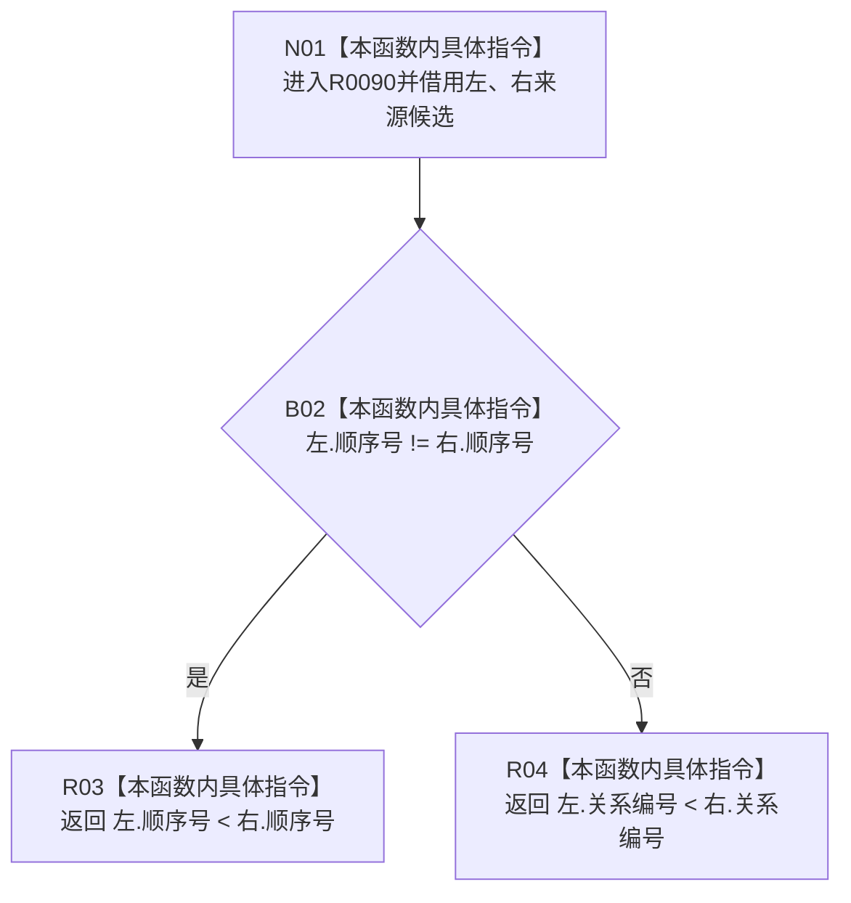

# CF-L7-0025 关系仓库获取来源节点组排序比较现状流程图

图类型：现状流程图
代码版本：`3920a74638264f9f539d50f32f3c9fe5fb1982ab`
源码 blob：`f7a9ea9a09d3065468208c16f9ea34f806b6e183`
覆盖文件：`海中鱼巣/核心/关系仓库.cpp:884-889`
唯一根函数：R0090
完整签名：`bool 海中鱼巣::关系仓库::获取来源节点组(海中鱼巣::节点句柄, 海中鱼巣::关系类型) const::<lambda@关系仓库.cpp:884>::operator()(const 来源候选& 左, const 来源候选& 右) const`
参数：`左`、`右` 均为排序调用期间有效的 const 非拥有借用
返回结果：左候选应排在右候选之前时返回 `true`；先按顺序号升序，再按关系编号升序
已登记调用方：RCE0508（R0088 的 `std::sort` 比较器）
直接项目函数：无
外部边界：无；X01525 已停用，`std::sort` 调用属于外层 R0088
未解析项目调用：0
调用图：`流程图/主程序可达调用关系/01_main可达项目调用边表.md`
逐行映射表：`流程图/代码流程图/L7/CF-L7-0025_关系仓库获取来源节点组排序比较_逐行代码映射表.md`
偏差清单：无；已纠正 `std::sort` 调用方归属
依据提交 / 结构化消息：当前源码、RCE0508；X01525 停用裁决
结构读取与写入：只读两个候选的顺序号和关系编号；无结构写入
逻辑内返回：比较结果为 `false` 属正常排序协议结果
验证输出：884—889 行完整映射；1 条项目入边、0 条项目出边、0 个当前外部边界
不得作为施工许可：是
不得宣称：比较器内部调用 `std::sort`，或相等候选存在额外稳定次序

## 流程图

## 节点合同

| 节点 | 类型 | 输入绑定 | 输出绑定 | 事实读写 | 后继 |
| --- | --- | --- | --- | --- | --- |
| N01 | 本函数内具体指令 | RCE0508 提供的左右候选 | 两个 const 借用 | 无 | B02 |
| B02 | 本函数内具体指令 | 两个顺序号 | 是否不同 | 只读候选 | 是→R03；否→R04 |
| R03 | 本函数内具体指令 | 两个顺序号 | 严格小于比较结果 | 只读候选 | 结束 |
| R04 | 本函数内具体指令 | 两个关系编号 | 严格小于比较结果 | 只读候选 | 结束 |

## 当前边界

- RCE0508 表示 R0088 使用本 lambda 作为排序比较器。
- X01525 不属于 R0090 的当前外部边界；外层 `std::sort` 不在本函数源码范围内重复登记。
