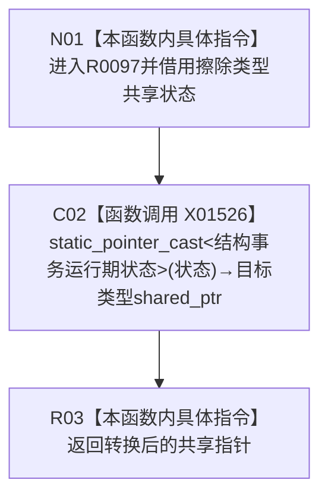

# CF-L7-0026 结构事务内部转换状态现状流程图

图类型：现状流程图
代码版本：`3920a74638264f9f539d50f32f3c9fe5fb1982ab`
源码 blob：`946512e4b88d29bbf6d43eb07b02823471489dae`
覆盖文件：`海中鱼巣/核心/协调.结构事务.ixx:40-42`
唯一根函数：R0097
完整签名：`std::shared_ptr<海中鱼巣::结构事务内部::结构事务运行期状态> 海中鱼巣::结构事务内部::转换状态(const std::shared_ptr<void>& 状态)`
参数：`状态` 为 const 非拥有引用；其共享所有权控制块在调用期间有效
返回结果：与输入共享所有权的 `std::shared_ptr<结构事务运行期状态>`；本函数不做动态类型检查
已登记调用方：RCE0513（R0098）、RCE0514（R0099）、RCE0516（R0100）、RCE0518（R0101）
直接项目函数：无
外部边界：X01526（`std::static_pointer_cast<结构事务运行期状态>(状态)`）
未解析项目调用：0
调用图：`流程图/主程序可达调用关系/01_main可达项目调用边表.md`
逐行映射表：`流程图/代码流程图/L7/CF-L7-0026_结构事务内部转换状态_逐行代码映射表.md`
偏差清单：无；当前实现依赖调用方保证擦除状态的真实类型
依据提交 / 结构化消息：当前源码、RCE0513、RCE0514、RCE0516、RCE0518、X01526
结构读取与写入：只读共享指针控制块；无机器事实写入
逻辑内返回：空输入产生空的目标类型共享指针
生命周期与资源释放：返回值与输入共享同一控制块；转换不复制运行期状态对象
验证输出：40—42 行完整映射；4 条项目入边、0 条项目出边、1 个外部边界
不得作为施工许可：是
不得宣称：静态转换验证了输入对象的动态类型或状态内容有效

## 流程图

## 节点合同

| 节点 | 类型 | 输入绑定 | 输出绑定 | 事实读写 | 后继 |
| --- | --- | --- | --- | --- | --- |
| N01 | 本函数内具体指令 | 四类已登记调用方提供的 `const shared_ptr<void>&` | 非拥有引用 | 无 | C02 |
| C02 | 函数调用 | `状态=状态` | 共享控制块的目标类型指针 | 只读控制块 | R03 |
| R03 | 本函数内具体指令 | C02 返回值 | `shared_ptr<结构事务运行期状态>` | 无 | 结束 |

## 当前边界

- X01526 是标准库智能指针边界，不取得项目函数身份。
- 本函数不检查空指针、域编号、纪元、许可或活动表。
