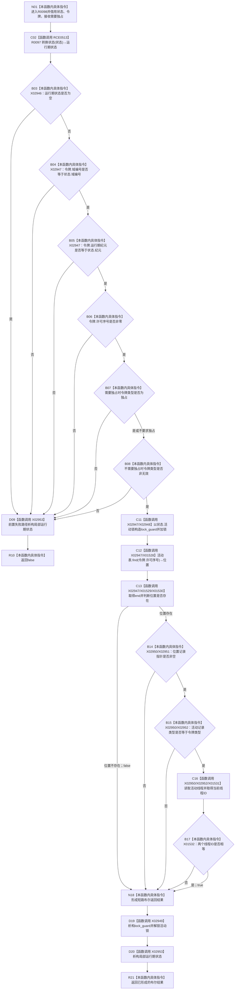

# CF-L7-0027 结构事务内部验证令牌现状流程图

图类型：现状流程图
代码版本：`3920a74638264f9f539d50f32f3c9fe5fb1982ab`
源码 blob：`946512e4b88d29bbf6d43eb07b02823471489dae`
覆盖文件：`海中鱼巣/核心/协调.结构事务.ixx:44-56`
唯一根函数：R0098
完整签名：`bool 海中鱼巣::结构事务内部::验证令牌(const std::shared_ptr<void>& 状态, const 海中鱼巣::结构事务令牌& 令牌, bool 需要独占)`
参数：`状态` 为 const 非拥有引用并共享运行期对象控制块；`令牌` 为 const 非拥有借用；`需要独占` 为值参数
返回结果：状态存在、域/纪元/序号/类型前置通过，且活动表中存在同序号、非空、类型相同、线程相同的活动记录时返回 `true`；否则返回 `false`
已登记调用方：RCE0196（F0399）、RCE0197（F0400）、RCE0515（R0099）
直接项目函数：RCE0513→R0097（`转换状态(状态)`，返回值绑定局部 `运行期状态`）
当前外部边界：X01528、X01529、X01530、X01531、X01532、X02946、X02947、X02948、X02949、X02950、X02951、X02952、X02953
停用边界：X01527（真实调用为项目边 RCE0513，不重复登记）
未解析项目调用：0
调用图：`流程图/主程序可达调用关系/01_main可达项目调用边表.md`
逐行映射表：`流程图/代码流程图/L7/CF-L7-0027_结构事务内部验证令牌_逐行代码映射表.md`
偏差清单：无；X01528—X01530 已按真实 `unordered_map` 非 const 迭代器静态类型校正
依据提交 / 结构化消息：当前源码、RCE0196、RCE0197、RCE0515、RCE0513 与上述当前外部边界稳定 ID
结构读取与写入：锁内只读运行期状态活动表和活动记录；不改变机器结构
逻辑内返回：状态、令牌字段或活动许可不满足时返回 `false`
生命周期与资源释放：局部 `shared_ptr` 在任一退出路径析构；取得活动锁后由 `lock_guard` 在返回前解锁
验证输出：44—56 行完整映射；3 条项目入边、1 条项目出边、13 个当前外部边界、0 个未解析调用
不得作为施工许可：是
不得宣称：返回 `true` 延长许可生命周期、授予新许可、取得独占锁或写入活动表

## 外部边界静态签名

- X01528：`std::unordered_map<std::uint64_t, std::unique_ptr<结构事务活动记录>>::iterator find(const std::uint64_t&)`
- X01529：`std::unordered_map<std::uint64_t, std::unique_ptr<结构事务活动记录>>::iterator end() noexcept`
- X01530：`bool std::unordered_map<std::uint64_t, std::unique_ptr<结构事务活动记录>>::iterator::operator==(const iterator&) const noexcept`；源码 `!=` 按比较重写口径登记
- X01531：`std::this_thread::get_id()`
- X01532：`bool operator==(std::thread::id, std::thread::id) noexcept`
- X02946：`explicit std::shared_ptr<结构事务运行期状态>::operator bool() const noexcept`
- X02947：`结构事务运行期状态* std::shared_ptr<结构事务运行期状态>::operator->() const noexcept`
- X02948：`explicit std::lock_guard<std::mutex>::lock_guard(std::mutex&)`
- X02949：`std::lock_guard<std::mutex>::~lock_guard() noexcept`
- X02950：`std::pair<const std::uint64_t, std::unique_ptr<结构事务活动记录>>* std::unordered_map<std::uint64_t, std::unique_ptr<结构事务活动记录>>::iterator::operator->() const noexcept`
- X02951：`bool operator==(const std::unique_ptr<结构事务活动记录>&, std::nullptr_t) noexcept`；源码 `!= nullptr` 按比较重写口径登记
- X02952：`结构事务活动记录* std::unique_ptr<结构事务活动记录>::operator->() const noexcept`
- X02953：`std::shared_ptr<结构事务运行期状态>::~shared_ptr() noexcept`

## 流程图

## 当前边界

- 前置字段检查全部通过后才取得 `活动锁`，锁内只读活动表。
- `位置->second != nullptr` 的 X02951 与位置比较 X01530 均按 C++20/MSVC 比较重写口径登记为 `operator==`。
- X02953 每次调用动态发生一次；图中 D09 与 D20 表示互斥退出路径。
- X01527 已停用，不能与 RCE0513 同时作为当前边界。
