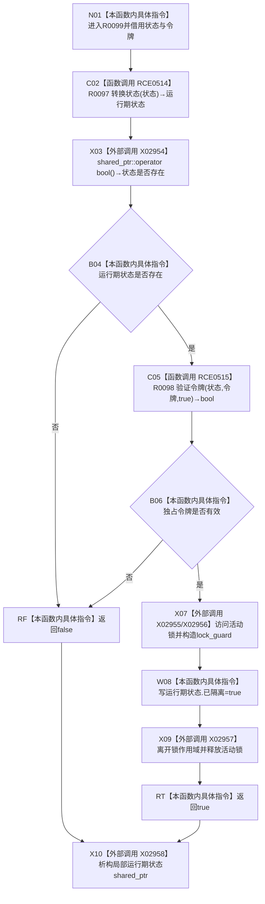

# CF-L7-0028 结构事务内部标记撤销失败隔离现状流程图

图类型：现状流程图
代码版本：`7ad8cf5113162fe92b9f8d43f2b5b9f00d292d1a`
源码事实提交：`3920a74638264f9f539d50f32f3c9fe5fb1982ab`
源码 blob：`946512e4b88d29bbf6d43eb07b02823471489dae`
覆盖文件：`海中鱼巣/核心/协调.结构事务.ixx:58-64`
唯一根函数：R0099
完整签名：`bool 海中鱼巣::结构事务内部::标记撤销失败隔离(const std::shared_ptr<void>& 状态, const 结构事务令牌& 令牌)`
参数：`状态` 为 const shared_ptr 借用；`令牌` 为 const 借用
返回结果：状态和独占令牌有效时把运行期状态标为隔离并返回 true，否则返回 false
已登记调用方：F0401，经 RCE0198
直接项目函数：RCE0514→R0097、RCE0515→R0098
外部边界：X02954 shared_ptr 布尔判断、X02955 shared_ptr 成员访问、X02956/X02957 lock_guard 构造/析构、X02958 shared_ptr 析构
停用外部误分类：X01533、X01534
未解析项目调用：0
逐行映射表：`流程图/代码流程图/L7/CF-L7-0028_结构事务内部标记撤销失败隔离_逐行代码映射表.md`
结构读取与写入：读取运行期状态与令牌；成功分支写 `运行期状态->已隔离=true`
验证输出：58—64 行完整映射；1 条项目入边、2 条项目出边、5 个当前外部边界
不得作为施工许可：是

## 流程图

## 当前边界

- X01533/X01534 是对 R0097/R0098 的重复误分类，当前图只引用项目边 RCE0514/RCE0515。
- X02957/X02958 表达局部 RAII 生命周期；异常展开时同样释放已构造资源。
- 本图只记录当前隔离标志写入，不证明撤销失败根因已经解决。
