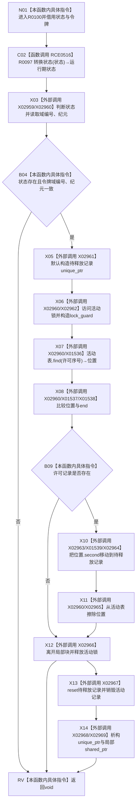

# CF-L7-0029 结构事务内部释放许可现状流程图

图类型：现状流程图
代码版本：`7ad8cf5113162fe92b9f8d43f2b5b9f00d292d1a`
源码事实提交：`3920a74638264f9f539d50f32f3c9fe5fb1982ab`
源码 blob：`946512e4b88d29bbf6d43eb07b02823471489dae`
覆盖文件：`海中鱼巣/核心/协调.结构事务.ixx:66-82`
唯一根函数：R0100
完整签名：`void 海中鱼巣::结构事务内部::释放许可(const std::shared_ptr<void>& 状态, const 结构事务令牌& 令牌) noexcept`
参数：`状态` 为 const shared_ptr 借用；`令牌` 为 const 借用
返回结果：`void`；无效状态、域/纪元不一致或许可不存在时直接返回
已登记调用方：F0631，经 RCE0285
直接项目函数：RCE0516→R0097
外部边界：X01536—X01539；X02959—X02969
停用外部误分类：X01535
未解析项目调用：0
逐行映射表：`流程图/代码流程图/L7/CF-L7-0029_结构事务内部释放许可_逐行代码映射表.md`
结构读取与写入：读取运行期状态与活动表；命中时从活动表擦除许可记录并在解锁后销毁记录
验证输出：66—82 行完整映射；1 条项目入边、1 条项目出边、15 个当前外部边界
不得作为施工许可：是

## 流程图

## 当前边界

- X01535 是 R0097 的重复误分类，当前只使用 RCE0516。
- 活动记录先从活动表移动到局部 `待释放记录`，再在活动锁释放后 reset，避免在锁内析构其锁对象。
- `noexcept` 入口的资源释放由 X02966/X02968/X02969 的 RAII 生命周期承载。
