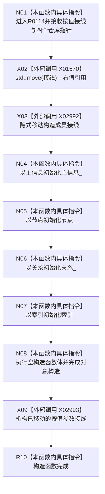

# CF-L7-0030 结构写入执行器构造现状流程图

图类型：现状流程图
代码版本：`73cc1af758e041519fa27c1dd57b9d5d07e3405a`
源码事实提交：`3920a74638264f9f539d50f32f3c9fe5fb1982ab`
源码 blob：`292e602cef1dd658ac2b507a3cc9ced7270a4a86`
覆盖文件：`海中鱼巣/核心/执行器.结构写入.ixx:60-67`
唯一根函数：R0114
完整签名：`海中鱼巣::结构写入执行器::结构写入执行器(海中鱼巣::结构事务接线 接线, 海中鱼巣::主信息仓库* 主信息, 海中鱼巣::节点仓库* 节点, 海中鱼巣::关系仓库* 关系, 海中鱼巣::索引仓库* 索引)`
参数：`接线` 为按值参数并移动到成员；四个仓库参数为非拥有原始指针，允许为空并由 R0115 后续拒绝
返回结果：构造完成的 `结构写入执行器` 对象；构造异常按 C++ 异常传播
已登记调用方：F0402/F0403/F0404/F0405/F0406/F0407/F0408/F0409/F0410，经 RCE1757/RCE0199/RCE0200/RCE0203/RCE1758/RCE0204/RCE0205/RCE1759/RCE0206
直接项目函数：无
外部边界：X01570 `std::move`；新增稳定 X02992 `结构事务接线` 隐式移动构造；新增稳定 X02993 按值参数 `接线` 隐式析构
未解析项目调用：0
逐行映射表：`流程图/代码流程图/L7/CF-L7-0030_结构写入执行器构造_逐行代码映射表.md`
结构读取与写入：只形成执行器成员接线和四个非拥有仓库指针，不写仓库机器事实
验证输出：60—67 行完整映射；9 条项目入边、0 条项目出边、3 个当前外部边界
不得作为施工许可：是

## 流程图

## 当前边界

- X01570 只把按值参数转换为右值；成员 `接线_` 的实际转移由新增稳定 X02992 的隐式移动构造完成。
- 成员初始化与空函数体完成后，已移动的按值参数仍按新增稳定 X02993 执行隐式析构。
- 四个仓库指针在本函数中不解引用；空值是否合法由 R0115 的执行器有效性检查决定。
