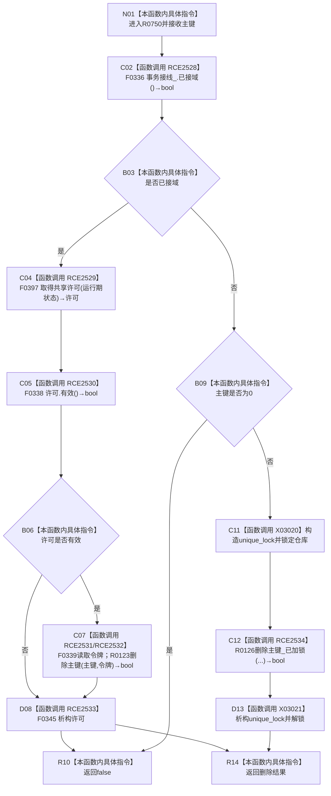

# CF-L7-0031 索引仓库删除主键无令牌重载现状流程图

图类型：现状流程图
代码版本：`3920a74638264f9f539d50f32f3c9fe5fb1982ab`
源码 blob：`8874312f67f19b220a08b1397c6103396878513d`
覆盖文件：`海中鱼巣/核心/索引仓库.cpp:288-296`
唯一根函数：R0750
完整签名：`bool 海中鱼巣::索引仓库::删除主键(std::uint64_t 主键)`
参数：`主键` 按值传入；隐式 `this` 为调用期间有效的索引仓库借用
返回结果：接域时返回带令牌重载结果；未接域且主键非零时返回已加锁删除结果；否则 `false`
已登记调用方：校正后的 RCE1587（R0574）
直接项目函数：RCE2528→F0336、RCE2529→F0397、RCE2530→F0338、RCE2531→F0339、RCE2532→R0123、RCE2533→F0345、RCE2534→R0126
外部边界：X03020 unique_lock 构造；X03021 unique_lock 析构；未解析项目调用：0
调用图：`流程图/主程序可达调用关系/01_main可达项目调用边表.md`
逐行映射表：`流程图/代码流程图/L7/CF-L7-0031_索引仓库删除主键无令牌重载_逐行代码映射表.md`
结构读取与写入：接域分支委托 R0123；未接域分支锁内委托 R0126 更新正反索引
验证输出：288—296 行完整映射；不得作为施工许可：是

当前边界：RCE1587 原先误连 R0123；当前一参数入口先取得共享许可，R0123 才是其接域后继。
