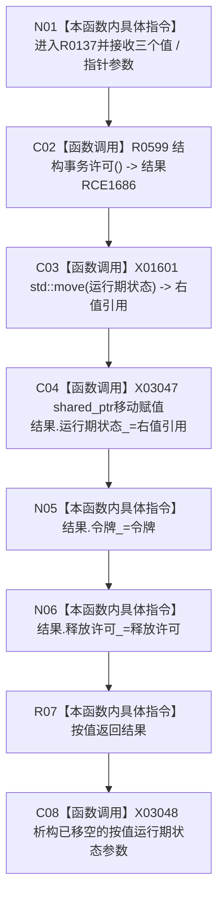

# CF-L7-0032 结构事务许可创建现状流程图

图类型：现状流程图
代码版本：`73cc1af758e041519fa27c1dd57b9d5d07e3405a`
源码 blob：`9d89cee25f00ba0f721d0b6c1bea517524e40663`
覆盖文件：`海中鱼巣/核心/结构事务接线.数据.h:43-52`
唯一根函数：R0137
完整签名：`static 海中鱼巣::结构事务许可 海中鱼巣::结构事务许可::创建(std::shared_ptr<void> 运行期状态, 海中鱼巣::结构事务令牌 令牌, void (*释放许可)(const std::shared_ptr<void>&, const 海中鱼巣::结构事务令牌&) noexcept)`
参数：`运行期状态` 按值持有共享所有权；`令牌` 按值传入；`释放许可` 为借用的 `noexcept` 函数指针
返回结果：按值返回保存运行期状态、令牌和释放回调的结构事务许可
已登记调用方：RCE0517（R0101，`协调.结构事务.ixx:130`）
直接项目函数：RCE1686 → R0599 `结构事务许可::结构事务许可()`（默认构造局部结果）
被调函数流程图：R0599 尚在正式制图队列中，当前仅以稳定项目边反查
外部边界：X01601 `std::move<std::shared_ptr<void>&>(运行期状态)`；X03047 `std::shared_ptr<void>::operator=(std::shared_ptr<void>&&)`；X03048 `std::shared_ptr<void>::~shared_ptr()`
未解析项目调用：0
调用图：`流程图/主程序可达调用关系/01_main可达项目调用边表.md`
逐行映射表：`流程图/代码流程图/L7/CF-L7-0032_结构事务许可创建_逐行代码映射表.md`
偏差清单：无
依据提交 / 结构化消息：当前源码、RCE0517、RCE1686、X01601、X03047、X03048
结构读取与写入：写局部结果对象的运行期状态、令牌和释放许可成员；不调用释放回调，不写仓库
逻辑内返回：不适用
生命周期与资源释放：运行期状态共享所有权移动到结果；移空的按值参数在函数退出边界析构
异常：本函数未声明 `noexcept`；`std::move` 仅转换值类别，共享指针移动赋值为 `noexcept`
验证输出：43—52 行完整映射；1 条项目入边、1 条项目出边、3 个外部边界
不得作为施工许可：是
不得宣称：许可对象形成证明事务已经提交、释放或发布

## 流程图

## 当前边界

- X01601 的精确签名为 `std::remove_reference_t<std::shared_ptr<void>&>&& std::move<std::shared_ptr<void>&>(std::shared_ptr<void>&) noexcept`。
- X03047 的精确签名为 `std::shared_ptr<void>& std::shared_ptr<void>::operator=(std::shared_ptr<void>&&) noexcept`。
- X03048 的精确签名为 `std::shared_ptr<void>::~shared_ptr() noexcept`，登记位置覆盖函数 43—52 行的按值参数退出边界。
- `return 结果` 为 NRVO 候选；当前图不把未发生保证的备用许可移动构造路径并列写成当前项目调用事实。
