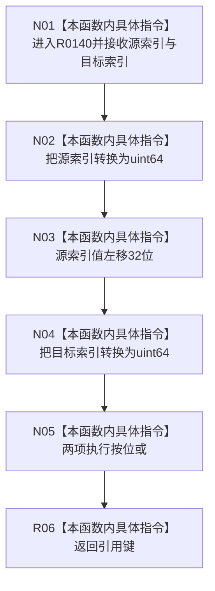

# CF-L7-0033 关系仓库性能基线隔离关系夹具引用键现状流程图

图类型：现状流程图
代码版本：`73cc1af758e041519fa27c1dd57b9d5d07e3405a`
源码 blob：`34c34bffcd80f78e28345292deb69aca2eabf38d`
覆盖文件：`海中鱼巣/核心/自检.关系仓库性能基线.ixx:433-436`
唯一根函数：R0140
完整签名：`std::uint64_t 海中鱼巣::关系仓库性能基线内部::隔离关系夹具::引用键(std::size_t 源索引, std::size_t 目标索引) const`
参数：`源索引`、`目标索引` 均按值传入
返回结果：源索引转换为 64 位后左移 32 位，与目标索引的 64 位值按位或所得引用键
已登记调用方：RCE0260（F0568，`自检.关系仓库性能基线.ixx:445`）
直接项目函数：无
外部边界：无；未解析项目调用：0
调用图：`流程图/主程序可达调用关系/01_main可达项目调用边表.md`
逐行映射表：`流程图/代码流程图/L7/CF-L7-0033_关系仓库性能基线隔离关系夹具引用键_逐行代码映射表.md`
偏差清单：无
依据提交 / 结构化消息：当前源码、RCE0260
结构读取与写入：纯计算，不读取或写入仓库
逻辑内返回：不适用
生命周期与资源释放：不取得资源
异常：函数未声明 `noexcept`，函数体仅执行整数转换、移位和按位或
验证输出：433—436 行完整映射；1 条项目入边、0 条项目出边、0 个外部边界
不得作为施工许可：是
不得宣称：引用键计算证明关系已创建、跟踪或持久化

## 流程图

## 当前边界

- F0568 只在源、目标索引范围检查通过后经 RCE0260 调用本函数。
- 本函数没有额外范围检查；高于 32 位的源索引位会在固定宽度左移中被截断，高于 32 位的目标索引位会参与按位或。
