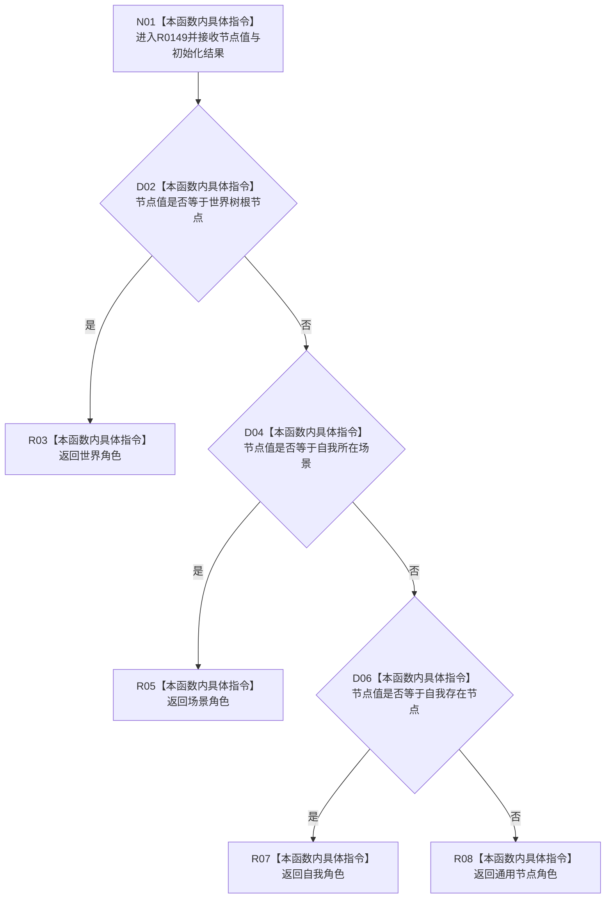

# CF-L7-0035 读取世界树节点名称角色现状流程图

图类型：现状流程图
代码版本：`3920a74638264f9f539d50f32f3c9fe5fb1982ab`
源码 blob：`fa157b5822e3d67b336ffbee06f763b1f22e59a6`
覆盖文件：`海中鱼巣/界面/投影.控制面板启动.ixx:25-38`
唯一根函数：R0149
完整签名：`世界树名称语素角色 海中鱼巣::读取世界树节点名称角色(节点句柄 节点值, const 世界树初始化结果& 初始化结果) noexcept`
参数：`节点值` 按值传入；`初始化结果` 以 const 引用借用
返回结果：返回世界、场景、自我或通用节点名称语素角色
已登记调用方：RCE0173（F0385，`投影.控制面板启动.ixx:49`）
直接项目函数：无
外部边界：无；未解析项目调用：0
调用图：`流程图/主程序可达调用关系/01_main可达项目调用边表.md`
逐行映射表：`流程图/代码流程图/L7/CF-L7-0035_读取世界树节点名称角色_逐行代码映射表.md`
偏差清单：无
依据提交 / 结构化消息：当前源码、RCE0173
结构读取与写入：只读初始化结果中的三个稳定节点句柄，不修改结构
逻辑内返回：三个具名角色和兜底通用角色均为正常返回
生命周期与资源释放：不取得资源
异常：`noexcept`
验证输出：25—38 行完整映射；1 条项目入边、0 条项目出边、0 个外部边界
不得作为施工许可：是
不得宣称：角色判定证明名称语素已经读取、写入或参与机器事实裁决

## 流程图

## 当前边界

- 本函数只按三项初始化句柄的优先顺序判定显示角色。
- 兜底返回通用节点，不产生非成功结果或结构写入。
