# CF-L7-0036 创建控件现状流程图

图类型：现状流程图
代码版本：`3920a74638264f9f539d50f32f3c9fe5fb1982ab`
源码 blob：`fe9dad1eb3728c823beccf305c783be96a3df33d`
覆盖文件：`海中鱼巣/界面/控制面板窗口.cpp:1007-1134`
唯一根函数：R0151
完整签名：`bool 海中鱼巣::控制面板窗口::窗口实现::创建控件()`
参数：无显式参数；借用并更新 `this`
返回结果：字体、必需控件、导航/树/下拉或数据库列创建失败返回 false；全部创建和首次填充完成返回 true
已登记调用方：RCE0186（F0396，`控制面板窗口.cpp:1609`）
直接项目函数：F0393（RCE0620）、R0183（RCE0621）、R0189（RCE0622）、R0192（RCE0623）、R0193（RCE0624）、R0177（RCE0625）、R0152（RCE0626）、R0155（RCE0627）、R0198（RCE0628）、R0194（RCE0629）、R0195（RCE0630）、R0156（RCE0631）
外部边界：X01613、X01614、X01615、X01616、X01617、X01618、X01619、X01620、X01621、X01622、X01623、X01624、X01625、X01626、X01627、X01628、X01629、X01630、X01631、X01632、X01633、X01634、X01635、X01636、X01637、X01638、X01639、X01640、X01641、X01642、X01643、X01644、X01645、X01646、X01647、X01648、X01649、X01650、X01651、X01652、X01653、X01654、X01655、X03061、X03062；未解析项目调用：0
调用图：`流程图/主程序可达调用关系/01_main可达项目调用边表.md`
逐行映射表：`流程图/代码流程图/L7/CF-L7-0036_创建控件_逐行代码映射表.md`
偏差清单：无
依据提交 / 结构化消息：当前源码、RCE0186、RCE0620—RCE0631、X01613—X01655、X03061、X03062
结构读取与写入：创建 Win32 字体和控件句柄，填充控件初始显示；不写项目机器事实
逻辑内返回：无；必需资源或界面重建失败均按当前代码返回 false
生命周期与资源释放：创建的字体和窗口句柄保存到窗口实现，释放由窗口生命周期其它函数承担
异常：未声明 `noexcept`
验证输出：1007—1134 行完整映射；1 条项目入边、12 条项目出边、45 个外部边界
不得作为施工许可：是
不得宣称：控件创建成功证明显示材料正确、数据库可用或任何领域能力完成

## 流程图

```mermaid
flowchart TD
    N01["N01【本函数内具体指令】进入R0151"]
    C02["C02【函数调用】CreateFontW创建标题字体〔X01613〕"]
    C03["C03【函数调用】CreateFontW创建正文字体〔X01614〕"]
    D04{"D04【本函数内具体指令】两个字体句柄是否均非空"}
    C05["C05【函数调用】F0393 标记字体创建追根因错误〔RCE0620、X01615〕"]
    R06["R06【本函数内具体指令】返回false"]
    C07["C07【函数调用】GetModuleHandleW并CreateWindowExW创建标题文本〔X01616、X01617〕"]
    C08["C08【函数调用】GetModuleHandleW并CreateWindowExW创建边界文本〔X01618、X01619〕"]
    C09["C09【函数调用】GetModuleHandleW并CreateWindowExW创建导航栏〔X01620、X01621〕"]
    C10["C10【函数调用】GetModuleHandleW并CreateWindowExW创建树视图〔X01622、X01623〕"]
    C11["C11【函数调用】GetModuleHandleW并CreateWindowExW创建概念根下拉〔X01624、X01625〕"]
    C12["C12【函数调用】GetModuleHandleW并CreateWindowExW创建上一根页按钮〔X01626、X01627〕"]
    C13["C13【函数调用】GetModuleHandleW并CreateWindowExW创建下一根页按钮〔X01628、X01629〕"]
    C14["C14【函数调用】GetModuleHandleW并CreateWindowExW创建节点数文本〔X01630、X01631〕"]
    C15["C15【函数调用】GetModuleHandleW并CreateWindowExW创建关系数文本〔X01632、X01633〕"]
    C16["C16【函数调用】GetModuleHandleW并CreateWindowExW创建索引数文本〔X01634、X01635〕"]
    C17["C17【函数调用】GetModuleHandleW并CreateWindowExW创建详情编辑框〔X01636、X01637〕"]
    C18["C18【函数调用】GetModuleHandleW并CreateWindowExW创建数据库标题文本〔X01638、X01639〕"]
    C19["C19【函数调用】GetModuleHandleW并CreateWindowExW创建数据库列表〔X01640、X01641〕"]
    C20["C20【函数调用】GetModuleHandleW并CreateWindowExW创建刷新按钮〔X01642、X01643〕"]
    C21["C21【函数调用】GetModuleHandleW并CreateWindowExW创建操作请求按钮〔X01644、X01645〕"]
    C22["C22【函数调用】GetModuleHandleW并CreateWindowExW创建关闭按钮〔X01646、X01647〕"]
    C23["C23【函数调用】GetModuleHandleW并CreateWindowExW创建状态栏〔X01648、X01649〕"]
    D24{"D24【本函数内具体指令】全部必需控件句柄是否非空"}
    C25["C25【函数调用】F0393 标记必需控件创建追根因错误〔RCE0620、X01650〕"]
    R26["R26【本函数内具体指令】返回false"]
    C27["C27【函数调用】SendMessageW给标题文本设置标题字体〔X01651〕"]
    L28{"L28【本函数内具体指令】遍历其余17个控件"}
    C29["C29【函数调用】SendMessageW给当前控件设置正文字体〔X01652〕"]
    C30["C30【函数调用】R0183 重建导航栏()〔RCE0621〕"]
    D31{"D31【本函数内具体指令】导航栏重建是否成功"}
    R32["R32【本函数内具体指令】失败返回false"]
    C33["C33【函数调用】R0189 重建当前树视图()〔RCE0622〕"]
    C34["C34【函数调用】R0192 重建概念根下拉()〔RCE0623〕"]
    D35{"D35【本函数内具体指令】树视图与概念根下拉是否都成功"}
    R36["R36【本函数内具体指令】失败返回false"]
    C37["C37【函数调用】R0193 更新根页按钮状态()〔RCE0624〕"]
    C38["C38【函数调用】ListView_SetExtendedListViewStyle设置数据库列表样式〔X01653〕"]
    N39["N39【本函数内具体指令】构造六项数据库列标题与宽度数组"]
    L40{"L40【函数调用】array::size给出六项数据库列边界〔X03061〕"}
    N41["N41【函数调用】array::operator[]读取当前列并填写LVCOLUMNW〔X03062〕"]
    C42["C42【函数调用】ListView_InsertColumn插入当前列〔X01654〕"]
    D43{"D43【本函数内具体指令】插入结果是否为-1"}
    C44["C44【函数调用】F0393 标记数据库列创建追根因错误〔RCE0620、X01655〕"]
    R45["R45【本函数内具体指令】返回false"]
    C46["C46【函数调用】R0177 读取数据库审计材料()〔RCE0625〕"]
    C47["C47【函数调用】R0152 更新总览控件()〔RCE0626〕"]
    C48["C48【函数调用】R0155 更新数据库控件()〔RCE0627〕"]
    C49["C49【函数调用】R0198 更新当前分页内容()〔RCE0628〕"]
    C50["C50【函数调用】R0194 更新菜单状态()〔RCE0629〕"]
    C51["C51【函数调用】R0195 应用分页控件可见性()〔RCE0630〕"]
    C52["C52【函数调用】R0156 布局控件()〔RCE0631〕"]
    R53["R53【本函数内具体指令】返回true"]

    N01 --> C02 --> C03 --> D04
    D04 -- 否 --> C05 --> R06
    D04 -- 是 --> C07 --> C08 --> C09 --> C10 --> C11 --> C12 --> C13 --> C14 --> C15 --> C16 --> C17 --> C18 --> C19 --> C20 --> C21 --> C22 --> C23 --> D24
    D24 -- 否 --> C25 --> R26
    D24 -- 是 --> C27 --> L28
    L28 -- 有下一控件 --> C29 --> L28
    L28 -- 遍历完成 --> C30 --> D31
    D31 -- 否 --> R32
    D31 -- 是 --> C33 --> C34 --> D35
    D35 -- 否 --> R36
    D35 -- 是 --> C37 --> C38 --> N39 --> L40
    L40 -- 有下一列 --> N41 --> C42 --> D43
    D43 -- 是 --> C44 --> R45
    D43 -- 否 --> L40
    L40 -- 遍历完成 --> C46 --> C47 --> C48 --> C49 --> C50 --> C51 --> C52 --> R53
```

## 当前边界

- 每个 `GetModuleHandleW` 与对应 `CreateWindowExW` 都保留独立稳定外部边界身份。
- 本函数只检查句柄与项目重建函数的结果；字体消息、控件消息和列表样式设置结果未被检查。
- 失败分支不在本函数内回收已经创建的前序字体或控件。
