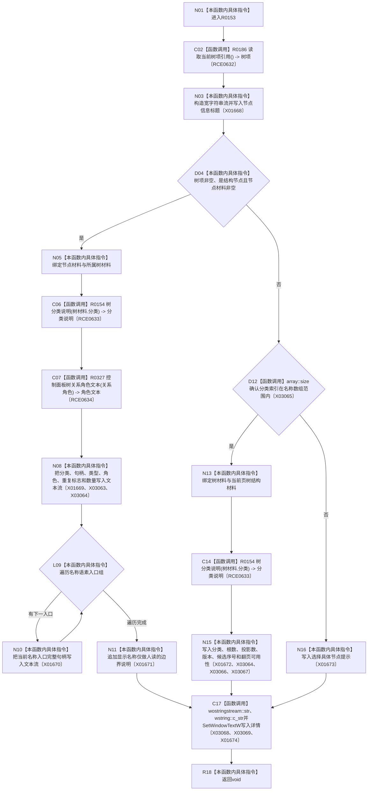

# CF-L7-0037 更新详情控件现状流程图

图类型：现状流程图
代码版本：`3920a74638264f9f539d50f32f3c9fe5fb1982ab`
源码 blob：`fe9dad1eb3728c823beccf305c783be96a3df33d`
覆盖文件：`海中鱼巣/界面/控制面板窗口.cpp:1145-1209`
唯一根函数：R0153
完整签名：`void 海中鱼巣::控制面板窗口::窗口实现::更新详情控件() const`
参数：无显式参数；只读借用 `this`
返回结果：`void`
已登记调用方：RCE0189（F0396）、RCE0644（R0158）、RCE0714（R0198）、RCE0734（R0201）
直接项目函数：R0186（RCE0632，读取当前树项引用）、R0154（RCE0633，树分类说明）、R0327（RCE0634，控制面板树关系角色文本）
外部边界：X01668、X01669、X01670、X01671、X01672、X01673、X01674、X03063、X03064、X03065、X03066、X03067、X03068、X03069；未解析项目调用：0
调用图：`流程图/主程序可达调用关系/01_main可达项目调用边表.md`
逐行映射表：`流程图/代码流程图/L7/CF-L7-0037_更新详情控件_逐行代码映射表.md`
偏差清单：无
依据提交 / 结构化消息：当前源码、RCE0189、RCE0644、RCE0714、RCE0734、RCE0632—RCE0634、X01668—X01674、X03063—X03069
结构读取与写入：只读当前快照和当前树项，组装并写入人读详情文本
逻辑内返回：未选中具体节点时输出分类摘要或选择提示
生命周期与资源释放：局部宽字符串流和临时字符串在函数结束时释放
异常：未声明 `noexcept`
验证输出：1145—1209 行完整映射；4 条项目入边、3 条项目出边、14 个外部边界
不得作为施工许可：是
不得宣称：详情文本裁决节点、关系、需求、任务、方法或数据库机器事实

## 流程图

## 当前边界

- 具体节点分支显示完整稳定句柄，但显示文本本身仍是非权威材料。
- 分类摘要分支读取当前页统计和游标状态，不在本函数内重新请求树材料。
- 容器大小、游标存在性与字符串临时调用使用顶层冻结的 X03063—X03069 稳定身份。
