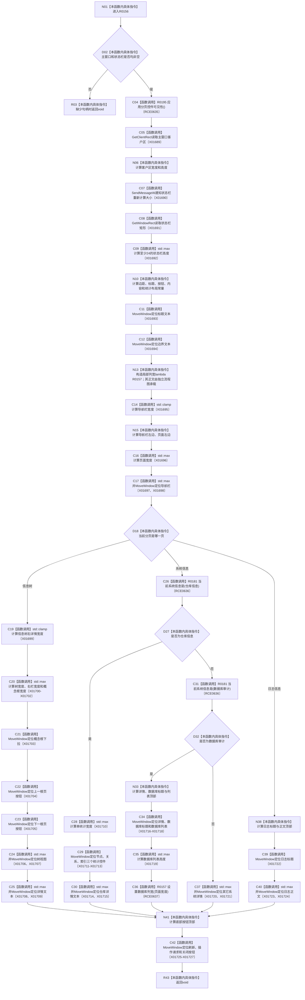

# CF-L7-0038 布局控件现状流程图

图类型：现状流程图
代码版本：`3920a74638264f9f539d50f32f3c9fe5fb1982ab`
源码 blob：`fe9dad1eb3728c823beccf305c783be96a3df33d`
覆盖文件：`海中鱼巣/界面/控制面板窗口.cpp:1247-1353`
唯一根函数：R0156
完整签名：`void 海中鱼巣::控制面板窗口::窗口实现::布局控件() const`
参数：无显式参数；只读借用 `this`
返回结果：`void`
已登记调用方：RCE0187（F0396）、RCE0631（R0151）、RCE0645（R0158）、RCE0661（R0164）、RCE0726（R0199）、RCE0740（R0201）
直接项目函数：R0195（RCE0635，应用分页控件可见性）、R0181（RCE0636，当前系统信息是）、R0157（RCE0637，设置数据库列宽 lambda）
外部边界：X01689、X01690、X01691、X01692、X01693、X01694、X01695、X01696、X01697、X01698、X01699、X01700、X01701、X01702、X01703、X01704、X01705、X01706、X01707、X01708、X01709、X01710、X01711、X01712、X01713、X01714、X01715、X01716、X01717、X01718、X01719、X01720、X01721、X01722、X01723、X01724、X01725、X01726、X01727；未解析项目调用：0
调用图：`流程图/主程序可达调用关系/01_main可达项目调用边表.md`
逐行映射表：`流程图/代码流程图/L7/CF-L7-0038_布局控件_逐行代码映射表.md`
被调函数流程图：R0157 对应 `流程图/代码流程图/L8/CF-L8-0015_布局控件设置数据库列宽lambda_现状流程图.md`
偏差清单：无
依据提交 / 结构化消息：当前源码、全部 6 条项目入边、RCE0635—RCE0637、X01689—X01727
结构读取与写入：只读取窗口尺寸和当前分页/系统信息选择，调整 Win32 控件位置、尺寸与可见性
逻辑内返回：主窗口或状态栏为空时正常返回
生命周期与资源释放：局部 RECT、整数和 lambda 按作用域释放；不取得控件所有权
异常：未声明 `noexcept`
验证输出：1247—1353 行完整映射；6 条项目入边、3 条项目出边、39 个外部边界
不得作为施工许可：是
不得宣称：布局或可见性证明相应材料有效或业务能力完成

## 流程图

## 当前边界

- R0157 的 lambda 正文在 1273—1287 行拥有独立函数身份；R0156 仅记录 lambda 构造和 1338 行的实际调用边 RCE0637。
- 每个 `MoveWindow`、尺寸查询和标准算法边界均按 X01689—X01727 保留。
- 本函数未检查 Win32 布局调用的返回结果。
