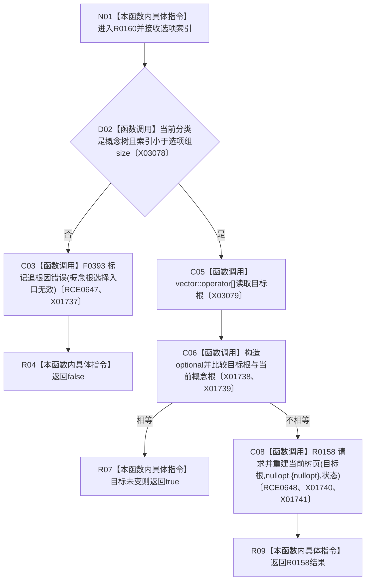

# CF-L7-0039 切换概念根现状流程图

图类型：现状流程图
代码版本：`3920a74638264f9f539d50f32f3c9fe5fb1982ab`
源码 blob：`fe9dad1eb3728c823beccf305c783be96a3df33d`
覆盖文件：`海中鱼巣/界面/控制面板窗口.cpp:1390-1402`
唯一根函数：R0160
完整签名：`bool 海中鱼巣::控制面板窗口::窗口实现::切换概念根(std::size_t 选项索引)`
参数：`选项索引` 按值传入
返回结果：入口无效或重建失败返回 false；目标已是当前根或重建成功返回 true
已登记调用方：RCE0191（F0396，`控制面板窗口.cpp:1644`）
直接项目函数：F0393（RCE0647，标记追根因错误）、R0158（RCE0648，请求并重建当前树页）
外部边界：X01737—X01741、X03078、X03079；未解析项目调用：0
调用图：`流程图/主程序可达调用关系/01_main可达项目调用边表.md`
逐行映射表：`流程图/代码流程图/L7/CF-L7-0039_切换概念根_逐行代码映射表.md`
偏差清单：无
依据提交 / 结构化消息：当前源码、RCE0191、RCE0647、RCE0648、X01737—X01741、X03078、X03079
结构读取与写入：读取当前分类、概念根选项和当前概念根；结构更新委托 R0158
逻辑内返回：目标根未变化时返回 true；无效分类或越界按当前代码返回 false 并标记追根因错误
生命周期与资源释放：构造临时 optional 和游标历史向量
异常：未声明 `noexcept`
验证输出：1390—1402 行完整映射；1 条项目入边、2 条项目出边、7 个外部边界
不得作为施工许可：是
不得宣称：返回 true 证明任何领域概念根机器事实发生变化

## 流程图

## 当前边界

- 入口无效被当前实现标记为追根因错误，而不是普通逻辑拒绝。
- 实际树页替换、回退与界面更新由 R0158 承担。
