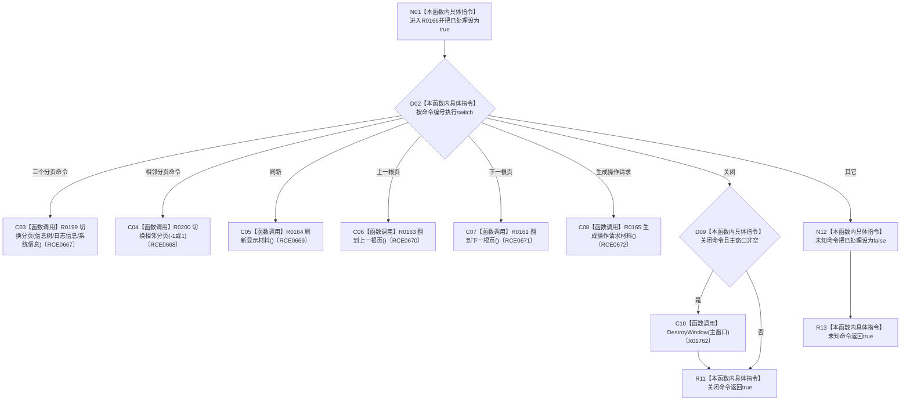

# CF-L7-0040 尝试处理命令编号现状流程图

图类型：现状流程图
代码版本：`3920a74638264f9f539d50f32f3c9fe5fb1982ab`
源码 blob：`fe9dad1eb3728c823beccf305c783be96a3df33d`
覆盖文件：`海中鱼巣/界面/控制面板窗口.cpp:1488-1518`
唯一根函数：R0166
完整签名：`bool 海中鱼巣::控制面板窗口::窗口实现::尝试处理命令编号(WORD 命令编号, bool& 已处理)`
参数：命令编号按值传入；已处理以可写引用传入并由本函数设置
返回结果：返回所选处理函数结果；关闭或未知命令返回 true
已登记调用方：RCE0193（F0396，`控制面板窗口.cpp:1660`）
直接项目函数：R0199（RCE0667，切换分页）、R0200（RCE0668，切换相邻分页）、R0164（RCE0669）、R0163（RCE0670）、R0161（RCE0671）、R0165（RCE0672）
外部边界：X01762（DestroyWindow）；未解析项目调用：0
调用图：`流程图/主程序可达调用关系/01_main可达项目调用边表.md`
逐行映射表：`流程图/代码流程图/L7/CF-L7-0040_尝试处理命令编号_逐行代码映射表.md`
偏差清单：无
依据提交 / 结构化消息：当前源码、RCE0193、RCE0667—RCE0672、X01762
结构读取与写入：写出已处理标志；按命令更新界面或销毁窗口
逻辑内返回：未知命令写出未处理并返回 true
生命周期与资源释放：关闭命令可调用 DestroyWindow 销毁主窗口
异常：未声明 `noexcept`
验证输出：1488—1518 行完整映射；1 条项目入边、6 条项目出边、1 个外部边界
不得作为施工许可：是
不得宣称：命令处理成功证明任何领域动作已执行

## 流程图

## 当前边界

- 六类项目调用分支直接返回被调函数的 bool 结果。
- 关闭窗口时不读取 DestroyWindow 的返回值。
- 未知命令不是错误：通过 `已处理=false` 交还调用方。
