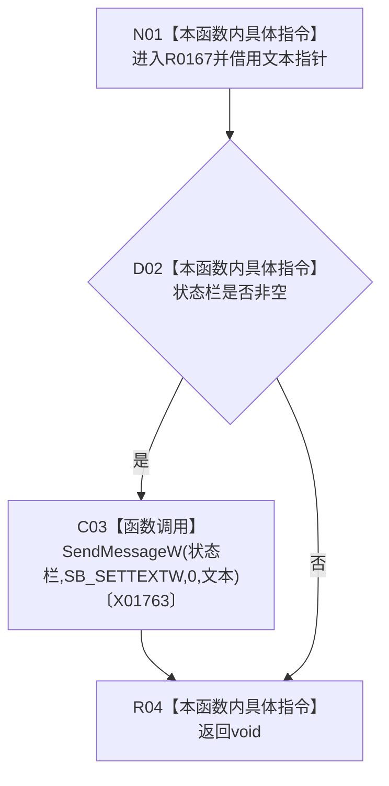

# CF-L7-0041 设置状态栏文本现状流程图

图类型：现状流程图
代码版本：`3920a74638264f9f539d50f32f3c9fe5fb1982ab`
源码 blob：`fe9dad1eb3728c823beccf305c783be96a3df33d`
覆盖文件：`海中鱼巣/界面/控制面板窗口.cpp:1520-1524`
唯一根函数：R0167
完整签名：`void 海中鱼巣::控制面板窗口::窗口实现::设置状态栏文本(const wchar_t* 文本) const`
参数：`文本` 为借用的只读宽字符串指针；本函数不接管生命周期
返回结果：`void`
已登记调用方：RCE0190、RCE0646、RCE0662、RCE0666、RCE0686、RCE0727、RCE0731
直接项目函数：无
外部边界：X01763（SendMessageW）；未解析项目调用：0
调用图：`流程图/主程序可达调用关系/01_main可达项目调用边表.md`
逐行映射表：`流程图/代码流程图/L7/CF-L7-0041_设置状态栏文本_逐行代码映射表.md`
偏差清单：无
依据提交 / 结构化消息：当前源码、全部 7 条项目入边、X01763
结构读取与写入：只更新非空状态栏的显示文本
逻辑内返回：状态栏为空时正常返回
生命周期与资源释放：不持有文本或控件
异常：未声明 `noexcept`
验证输出：1520—1524 行完整映射；7 条项目入边、0 条项目出边、1 个外部边界
不得作为施工许可：是
不得宣称：状态栏文本是机器事实、计划状态或能力完成证据

## 流程图

## 当前边界

- 状态栏为空时静默忽略。
- 消息结果不被读取，文本只做人读显示。
