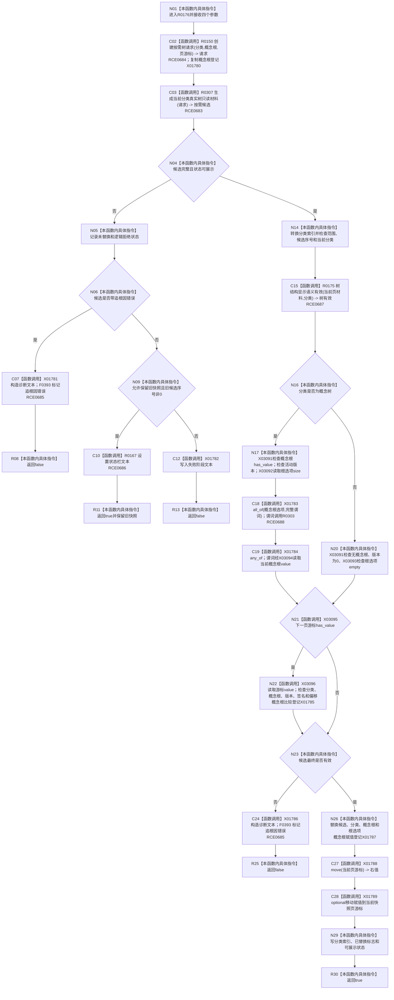

# CF-L7-0042 读取并替换当前树现状流程图

图类型：现状流程图
代码版本：`3920a74638264f9f539d50f32f3c9fe5fb1982ab`
源码 blob：`fe9dad1eb3728c823beccf305c783be96a3df33d`
覆盖文件：`海中鱼巣/界面/控制面板窗口.cpp:317-384`
唯一根函数：R0176
完整签名：`bool 海中鱼巣::控制面板窗口::窗口实现::读取并替换当前树(海中鱼巣::控制面板树分类 分类, std::optional<海中鱼巣::节点句柄> 当前概念根, std::optional<海中鱼巣::控制面板根页游标> 当前页游标, bool 允许保留旧快照)`
参数：分类、概念根、页游标按值传入；保留旧快照标志按值传入
返回结果：候选有效并替换、或允许保留旧快照时返回 `true`；追根因或无法形成可用页时返回 `false`
已登记调用方：RCE0180、RCE0638、RCE0652、RCE0735
直接项目函数：RCE0683 → R0307；RCE0684 → R0150；RCE0685 → F0393；RCE0686 → R0167；RCE0687 → R0175；RCE0688 → R0303
外部边界：X01780—X01789、X03091—X03096；未解析项目调用：0
逐行映射表：`流程图/代码流程图/L7/CF-L7-0042_读取并替换当前树_逐行代码映射表.md`
依据：关系发布基线 `010784a906e8283644a63a742151f6457a847c38` 与冻结源码
结构读写：成功时替换当前树候选、分类、概念根、根选项、页游标和状态；逻辑拒绝分支可保留旧快照
不得作为施工许可：是
不得宣称：返回 `true` 必然代表产生了新快照

## 流程图

## 当前边界

- “保留旧快照”分支返回真，但 `最近按需候选已替换` 保持为假。
- 概念树与其它分类使用互斥的概念根合同；下一页游标存在时追加五项一致性复核。
