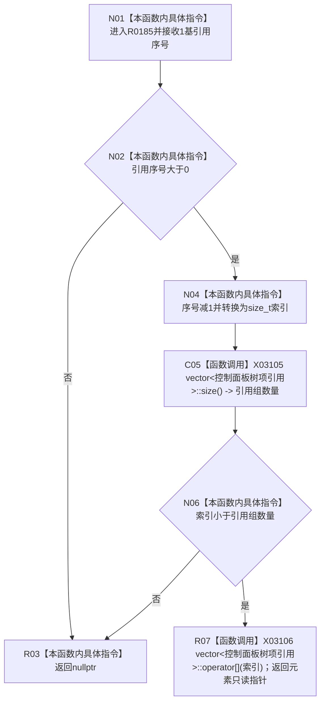

# CF-L7-0043 读取树项引用现状流程图

图类型：现状流程图
代码版本：`3920a74638264f9f539d50f32f3c9fe5fb1982ab`
源码 blob：`fe9dad1eb3728c823beccf305c783be96a3df33d`
覆盖文件：`海中鱼巣/界面/控制面板窗口.cpp:586-595`
唯一根函数：R0185
完整签名：`const 海中鱼巣::控制面板树项引用* 海中鱼巣::控制面板窗口::窗口实现::读取树项引用(LPARAM 引用序号) const`
参数：`引用序号` 按值传入，使用 1 基编号
返回结果：序号有效且范围内时返回引用组元素的只读借用指针，否则返回 `nullptr`
已登记调用方：RCE0188、RCE0694
直接项目函数：无；外部边界：X03105、X03106；未解析项目调用：0
逐行映射表：`流程图/代码流程图/L7/CF-L7-0043_读取树项引用_逐行代码映射表.md`
依据：关系发布基线 `010784a906e8283644a63a742151f6457a847c38` 与冻结源码
结构读写：只读树项引用组，不转移元素所有权
不得作为施工许可：是
不得宣称：返回指针非空证明其节点材料仍满足显示语义

## 流程图

## 当前边界

- 返回指针借用 `树项引用组` 元素；后续容器扩容、清空或销毁可使其失效。
- 591 行 `size` 与 594 行 `operator[]` 已分别绑定 X03105、X03106。
