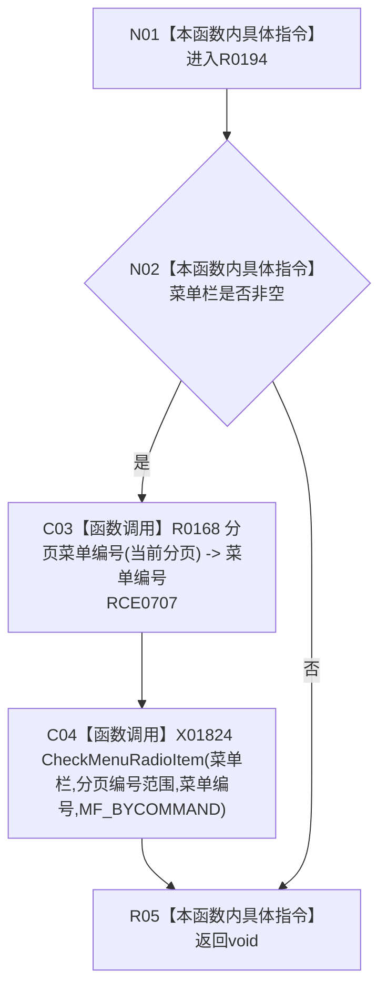

# CF-L7-0044 更新菜单状态现状流程图

图类型：现状流程图
代码版本：`3920a74638264f9f539d50f32f3c9fe5fb1982ab`
源码 blob：`fe9dad1eb3728c823beccf305c783be96a3df33d`
覆盖文件：`海中鱼巣/界面/控制面板窗口.cpp:754-763`
唯一根函数：R0194
完整签名：`void 海中鱼巣::控制面板窗口::窗口实现::更新菜单状态() const`
参数：无显式参数；读取菜单栏和当前分页
返回结果：`void`；菜单栏存在时更新分页单选项
已登记调用方：RCE0184、RCE0629、RCE0723
直接项目函数：RCE0707 → R0168
外部边界：X01824；未解析项目调用：0
逐行映射表：`流程图/代码流程图/L7/CF-L7-0044_更新菜单状态_逐行代码映射表.md`
依据：关系发布基线 `010784a906e8283644a63a742151f6457a847c38` 与冻结源码
结构读写：只更新 Windows 菜单勾选状态
不得作为施工许可：是
不得宣称：菜单勾选状态是分页事实的权威来源

## 流程图

## 当前边界

- 菜单栏为空时静默跳过，不形成失败结果。
- Windows 菜单调用的返回值未被读取。
