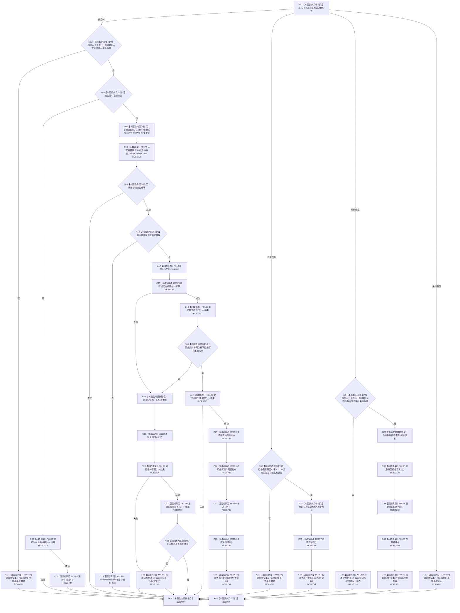

# CF-L7-0045 处理导航选择现状流程图

图类型：现状流程图
代码版本：`3920a74638264f9f539d50f32f3c9fe5fb1982ab`
源码 blob：`fe9dad1eb3728c823beccf305c783be96a3df33d`
覆盖文件：`海中鱼巣/界面/控制面板窗口.cpp:936-1005`
唯一根函数：R0201
完整签名：`bool 海中鱼巣::控制面板窗口::窗口实现::处理导航选择(std::uint32_t 选中索引)`
参数：`选中索引`，值传入的当前分页导航索引
返回结果：越界、树切换 / 重建 / 定位失败或未知分页时返回 `false`；完成当前分页导航处理或候选未替换时返回 `true`
已登记调用方：RCE0192
直接项目函数：RCE0731 → R0167；RCE0732 → F0393；RCE0733 → R0191；RCE0734 → R0153；RCE0735 → R0176；RCE0736 → R0189；RCE0737 → R0192；RCE0738 → R0193；RCE0739 → R0195；RCE0740 → R0156；RCE0741 → R0197；RCE0742 → R0198
外部边界：X01848—X01856、X03138、X03139；未解析项目调用：0
逐行映射表：`流程图/代码流程图/L7/CF-L7-0045_处理导航选择_逐行代码映射表.md`
依据：关系发布基线 `010784a906e8283644a63a742151f6457a847c38` 与冻结源码
结构读写：按分页更新窗口导航状态；信息树切换失败时尝试恢复旧快照、历史和分类索引
不得作为施工许可：是
不得宣称：导航选择或界面恢复会写入底层权威仓库

## 流程图

## 当前边界

- 939、983、992 行的名称数组 `size()` 已冻结为 X03138、X03139。
- 新分类界面重建失败时恢复的是窗口快照、根页历史和分类索引；旧页恢复失败只追加诊断，函数仍返回 `false`。
