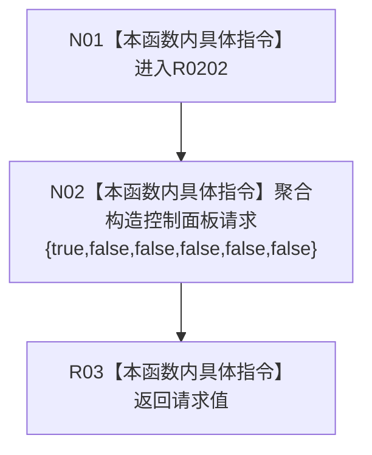

# CF-L7-0046 创建只读请求现状流程图

图类型：现状流程图
代码版本：`3920a74638264f9f539d50f32f3c9fe5fb1982ab`
源码 blob：`fe9dad1eb3728c823beccf305c783be96a3df33d`
覆盖文件：`海中鱼巣/界面/控制面板窗口.cpp:96-98`
唯一根函数：R0202
完整签名：`控制面板请求 海中鱼巣::{匿名命名空间@控制面板窗口.cpp}::创建只读请求()`
参数：无
返回结果：返回聚合值 `{true, false, false, false, false, false}` 的 `控制面板请求`
已登记调用方：RCE0176、RCE0619、RCE0663
直接项目函数：无
外部边界：无；未解析项目调用：0
逐行映射表：`流程图/代码流程图/L7/CF-L7-0046_创建只读请求_逐行代码映射表.md`
依据：关系发布基线 `010784a906e8283644a63a742151f6457a847c38` 与冻结源码
结构读写：只构造并返回请求材料，不执行控制面板动作
不得作为施工许可：是
不得宣称：请求材料已被消费或对应读取已经发生

## 流程图

## 当前边界

- 本函数不调用项目函数或外部函数。
- 六个布尔位按类型声明顺序聚合初始化；此图只记录当前代码值，不解释为新增机器规则。
