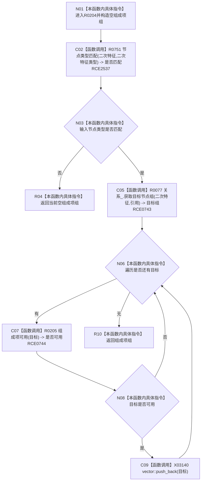

# CF-L7-0047 二次特征服务读取组成项现状流程图

图类型：现状流程图
代码版本：`3920a74638264f9f539d50f32f3c9fe5fb1982ab`
源码 blob：`ef359c1ba720ed96a64c81ca3fca2cb42a0824bd`
覆盖文件：`海中鱼巣/领域/二次特征服务.h:106-118`
唯一根函数：R0204
完整签名：`std::vector<节点句柄> 海中鱼巣::二次特征服务::读取组成项(节点句柄 二次特征) const`
参数：`二次特征`，值传入的候选二次特征节点句柄
返回结果：输入类型不匹配时返回空组；否则返回引用目标中通过 R0205 可用性检查的节点句柄组
已登记调用方：RCE0149
直接项目函数：RCE2537 → R0751；RCE0743 → R0077；RCE0744 → R0205
外部边界：X03140
逐行映射表：`流程图/代码流程图/L7/CF-L7-0047_二次特征服务读取组成项_逐行代码映射表.md`
依据：关系发布基线 `010784a906e8283644a63a742151f6457a847c38` 与冻结源码
结构读写：只读节点类型与引用关系，写局部返回向量
不得作为施工许可：是
不得宣称：过滤后的返回组会修复或删除不可用引用关系

## 流程图

## 当前边界

- `海中鱼巣/领域/二次特征服务.h:108` 调用同类私有函数 R0751；顶层已冻结 RCE2537，R0751 自身经 RCE2538 调 F0190。
- 114 行 `vector::push_back` 已冻结为 X03140。
