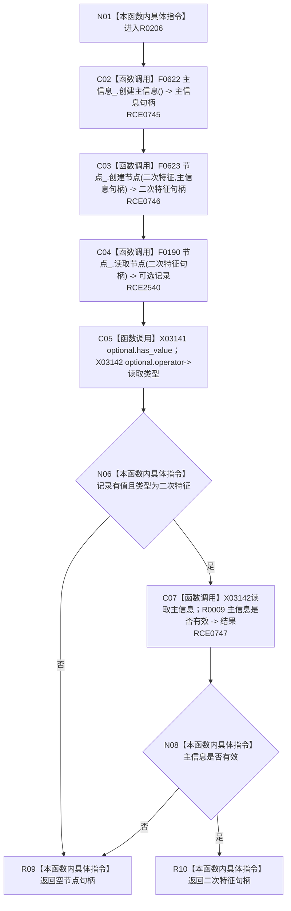

# CF-L7-0048 二次特征服务创建二次特征现状流程图

图类型：现状流程图
代码版本：`3920a74638264f9f539d50f32f3c9fe5fb1982ab`
源码 blob：`ef359c1ba720ed96a64c81ca3fca2cb42a0824bd`
覆盖文件：`海中鱼巣/领域/二次特征服务.h:38-47`
唯一根函数：R0206
完整签名：`节点句柄 海中鱼巣::二次特征服务::创建二次特征()`
参数：无显式参数；使用主信息仓库和节点仓库成员
返回结果：创建后读回记录存在、类型为二次特征且主信息有效时返回二次特征句柄；否则返回空句柄
已登记调用方：RCE0147
直接项目函数：RCE0745 → F0622；RCE0746 → F0623；RCE2540 → F0190；RCE0747 → R0009
外部边界：X03141、X03142
逐行映射表：`流程图/代码流程图/L7/CF-L7-0048_二次特征服务创建二次特征_逐行代码映射表.md`
依据：关系发布基线 `010784a906e8283644a63a742151f6457a847c38` 与冻结源码
结构读写：调用仓库创建主信息和二次特征节点，再只读复核
不得作为施工许可：是
不得宣称：返回空句柄会撤销此前可能发生的仓库写入

## 流程图

## 当前边界

- `海中鱼巣/领域/二次特征服务.h:41` 是对 F0190 的直接成员调用，顶层已冻结稳定边 RCE2540。
- 42—43 行的 `optional.has_value()` 与 `optional.operator->()` 已冻结为 X03141、X03142；失败返回前没有本函数级撤销。
