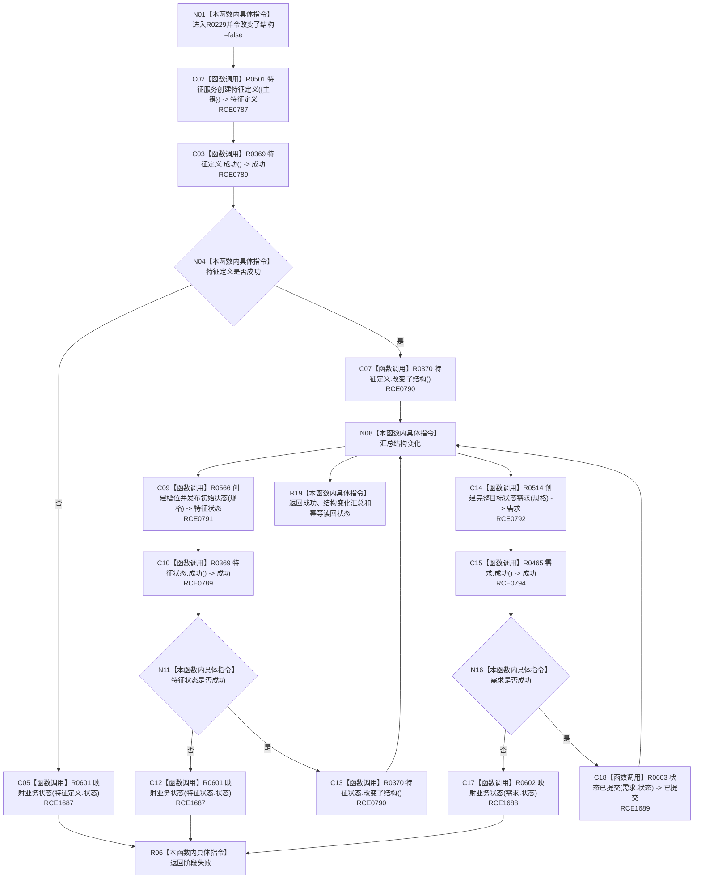

# CF-L7-0049 创建根需求组现状流程图

图类型：现状流程图
代码版本：`3920a74638264f9f539d50f32f3c9fe5fb1982ab`
源码 blob：`adf3fb33c53aa5aeaff2f7102bc9a4d7db3ba040`
覆盖文件：`海中鱼巣/领域/初始化.系统角色.ixx:209-237`
唯一根函数：R0229
完整签名：`根需求创建结果 海中鱼巣::系统角色初始化器::创建根需求组(std::uint64_t 特征定义主键, std::uint64_t 实例槽位主键, std::uint64_t 当前特征值主键, std::uint64_t 目标状态主键, std::uint64_t 根需求主键, 节点句柄 自我存在, 节点句柄 自我场景, std::int64_t 当前值, std::int64_t 目标值) const`
参数：五个稳定主键、两个节点句柄和两个 I64 值均按值传入
返回结果：三阶段都成功时返回成功及结构变化汇总；任一阶段失败时返回映射后的业务状态
已登记调用方：RCE0223（F0455）
直接项目函数：RCE0787、RCE0789、RCE1687、RCE0790、RCE0791、RCE0792、RCE0794、RCE1688、RCE1689
外部边界：无；未解析项目调用：0
逐行映射表：`流程图/代码流程图/L7/CF-L7-0049_创建根需求组_逐行代码映射表.md`
依据：关系发布基线 `dbe710096193fbd517edae5cb871decaf6b49bf3` 与冻结源码
结构读写：依次创建特征定义、槽位初始状态和完整目标状态需求；不回滚已完成前序阶段
不得作为施工许可：是
不得宣称：成功返回证明初始化器全部系统角色均已复核完成

## 流程图

## 当前边界

- 三个阶段顺序执行；后阶段失败时函数只返回失败，不撤销已完成的前序创建。
- 结构变化标志按三个结果的当前状态做逻辑或汇总。
