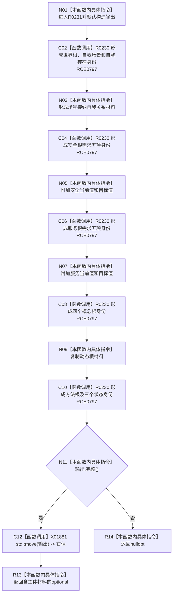

# CF-L7-0050 形成系统角色主体材料现状流程图

图类型：现状流程图
代码版本：`3920a74638264f9f539d50f32f3c9fe5fb1982ab`
源码 blob：`adf3fb33c53aa5aeaff2f7102bc9a4d7db3ba040`
覆盖文件：`海中鱼巣/领域/初始化.系统角色.ixx:248-283`
唯一根函数：R0231
完整签名：`std::optional<系统角色主体材料> 海中鱼巣::系统角色初始化器::形成主体材料(const 系统角色初始化参数& 参数, const 系统角色预检结果& 预检, 关系句柄 场景接纳自我关系) const`
参数：参数和预检只读借用；关系句柄按值传入
返回结果：输出材料完整时移动进 optional 返回，否则返回 `nullopt`
已登记调用方：RCE0225（F0455）
直接项目函数：RCE0797 → R0230（21 个调用点）
外部边界：X01881 `std::move(输出)`；未解析项目调用：0
逐行映射表：`流程图/代码流程图/L7/CF-L7-0050_形成系统角色主体材料_逐行代码映射表.md`
依据：关系发布基线 `dbe710096193fbd517edae5cb871decaf6b49bf3` 与冻结源码
结构读写：只形成聚合主体返回材料，不写仓库
不得作为施工许可：是
不得宣称：optional 非空证明所有主体语义已从仓库读回复核

## 流程图

## 当前边界

- RCE0797 在 21 个源码调用点复用同一 R0230 身份。
- 输出完整性失败不产生部分 optional；局部输出随后析构。
