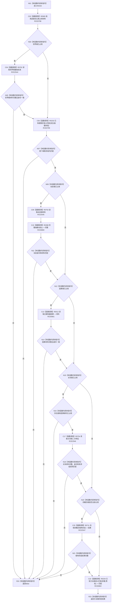

# CF-L7-0051 已有系统角色语义匹配现状流程图

图类型：现状流程图
代码版本：`3920a74638264f9f539d50f32f3c9fe5fb1982ab`
源码 blob：`adf3fb33c53aa5aeaff2f7102bc9a4d7db3ba040`
覆盖文件：`海中鱼巣/领域/初始化.系统角色.ixx:285-335`
唯一根函数：R0232
完整签名：`bool 海中鱼巣::系统角色初始化器::已有语义匹配(const 系统角色初始化参数& 参数, const 系统角色预检结果& 预检) const`
参数：参数与预检均为只读借用
返回结果：全部已占用主体语义与仓库读回一致时返回 `true`
已登记调用方：RCE0229（F0455）
直接项目函数：RCE0798 → R0565；RCE0799 → R0233；RCE0800 → R0398；RCE0801 → R0512；RCE0802 → R0234；RCE2544 → R0752；RCE2545 → R0753；RCE2546 → R0754；RCE2547 → R0711
外部边界：无；未解析项目调用：0
逐行映射表：`流程图/代码流程图/L7/CF-L7-0051_已有系统角色语义匹配_逐行代码映射表.md`
依据：关系发布基线 `dbe710096193fbd517edae5cb871decaf6b49bf3` 与冻结源码
结构读写：只读预检与领域材料，不写结构
不得作为施工许可：是
不得宣称：返回真证明尚未占用的角色已被创建

## 流程图

## 当前边界

- 未占用的单个可选角色不单独失败；已占用角色必须与读回材料完全一致。
- 四个显式服务调用已按 RCE2544—RCE2547 绑定稳定目标。
