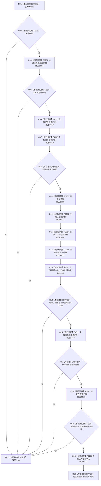

# CF-L7-0052 复核全部系统角色语义现状流程图

图类型：现状流程图
代码版本：`3920a74638264f9f539d50f32f3c9fe5fb1982ab`
源码 blob：`adf3fb33c53aa5aeaff2f7102bc9a4d7db3ba040`
覆盖文件：`海中鱼巣/领域/初始化.系统角色.ixx:434-477`
唯一根函数：R0236
完整签名：`bool 海中鱼巣::系统角色初始化器::复核全部语义(const 系统角色初始化参数& 参数, const 系统角色主体材料& 主体) const`
参数：参数与主体均为只读借用
返回结果：全部系统角色领域材料读回一致时返回 `true`
已登记调用方：RCE0222（F0454）；RCE0226（F0455）
直接项目函数：RCE0810 → R0237；RCE0811 → R0512；RCE0812 → R0398；RCE0813 → R0497；RCE0814 → R0238；RCE2554 → R0752；RCE2555 → R0753；RCE2556 → R0754；RCE2557 → R0711
外部边界：X03145（454 行临时 `vector<节点句柄>` 构造、比较与析构）；未解析项目调用：0
逐行映射表：`流程图/代码流程图/L7/CF-L7-0052_复核全部系统角色语义_逐行代码映射表.md`
依据：关系发布基线 `dbe710096193fbd517edae5cb871decaf6b49bf3` 与冻结源码
结构读写：只读主体与基础信息、需求、动态、因果、二次特征、概念图、方法和状态材料
不得作为施工许可：是
不得宣称：复核成功证明这些角色由本函数创建

## 流程图

## 当前边界

- 四个显式服务调用已按 RCE2554—RCE2557 绑定稳定目标。
