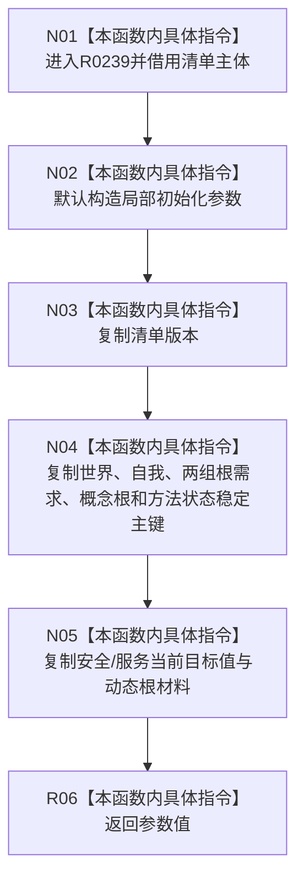

# CF-L7-0053 从系统角色清单形成参数现状流程图

图类型：现状流程图
代码版本：`3920a74638264f9f539d50f32f3c9fe5fb1982ab`
源码 blob：`adf3fb33c53aa5aeaff2f7102bc9a4d7db3ba040`
覆盖文件：`海中鱼巣/领域/初始化.系统角色.ixx:522-553`
唯一根函数：R0239
完整签名：`static 系统角色初始化参数 海中鱼巣::系统角色初始化器::从清单形成参数(const 系统角色清单& 清单) noexcept`
参数：清单为只读借用
返回结果：从清单主体字段复制形成的初始化参数值
已登记调用方：RCE0221（F0454）
直接项目函数：无
外部边界：无；未解析项目调用：0
逐行映射表：`流程图/代码流程图/L7/CF-L7-0053_从系统角色清单形成参数_逐行代码映射表.md`
依据：关系发布基线 `dbe710096193fbd517edae5cb871decaf6b49bf3` 与冻结源码
结构读写：只读清单并构造局部参数值，不写机器结构
不得作为施工许可：是
不得宣称：形成参数会发布或修改系统角色

## 流程图

## 当前边界

- 本函数仅做值式投影，不验证清单字段，也不产生结构写入。
