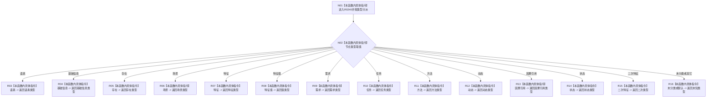

# CF-L7-0054 读取节点类型名称现状流程图

图类型：现状流程图
代码版本：`3920a74638264f9f539d50f32f3c9fe5fb1982ab`
源码 blob：`ba08c07c9863ba369a9b2a782a323ea5b5d206a5`
覆盖文件：`海中鱼巣/领域/初始化.语素.ixx:102-134`
唯一根函数：R0240
完整签名：`const 语素初始化显示项& 海中鱼巣::语素初始化结果::读取节点类型名称(节点类型 类型) const`
参数：类型按值传入
返回结果：对应节点类型的显示项只读引用；未分类和默认分支返回未知类型
已登记调用方：RCE0175（F0385）
直接项目函数：无
外部边界：无；X01892 已确认污染并停用
逐行映射表：`流程图/代码流程图/L7/CF-L7-0054_读取节点类型名称_逐行代码映射表.md`
依据：关系发布基线 `dbe710096193fbd517edae5cb871decaf6b49bf3` 与冻结源码
结构读写：只读当前结果对象的显示项
不得作为施工许可：是
不得宣称：显示项引用是节点类型机器事实

## 流程图

## 当前边界

- 104 行只是 `case 节点类型::语素`；X01892 已从聚合停用且不设替代。
