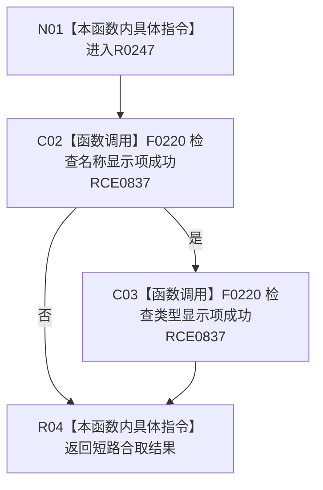

# CF-L7-0055 语素节点显示语义材料成功现状流程图

图类型：现状流程图
代码版本：`3920a74638264f9f539d50f32f3c9fe5fb1982ab`
源码 blob：`ba08c07c9863ba369a9b2a782a323ea5b5d206a5`
覆盖文件：`海中鱼巣/领域/初始化.语素.ixx:35-37`
唯一根函数：R0247
完整签名：`bool 海中鱼巣::语素节点显示语义材料::成功() const`
参数：无；隐式 `this` 只读
返回结果：名称与类型显示项都成功时返回 `true`
已登记调用方：RCE0172（F0385）
直接项目函数：RCE0837 → F0220
外部边界：无；未解析项目调用：0
逐行映射表：`流程图/代码流程图/L7/CF-L7-0055_语素节点显示语义材料成功_逐行代码映射表.md`
依据：关系发布基线 `dbe710096193fbd517edae5cb871decaf6b49bf3` 与冻结源码
结构读写：只读名称与类型显示项
不得作为施工许可：是
不得宣称：返回真证明语素机器结构完整

## 流程图

## 当前边界

- 本函数只组合两个人读显示项的成功投影，不写机器结构。
