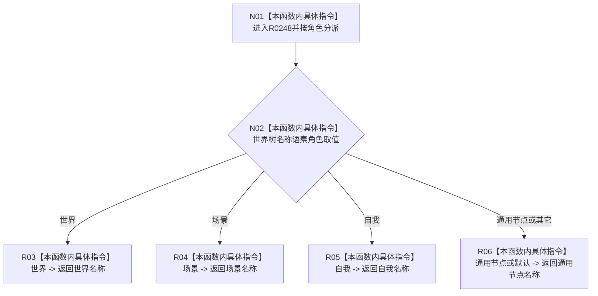

# CF-L7-0056 读取世界树名称现状流程图

图类型：现状流程图
代码版本：`3920a74638264f9f539d50f32f3c9fe5fb1982ab`
源码 blob：`ba08c07c9863ba369a9b2a782a323ea5b5d206a5`
覆盖文件：`海中鱼巣/领域/初始化.语素.ixx:88-100`
唯一根函数：R0248
完整签名：`const 语素初始化显示项& 海中鱼巣::语素初始化结果::读取世界树名称(世界树名称语素角色 角色) const`
参数：角色按值传入
返回结果：世界、场景、自我或通用节点名称显示项的只读引用
已登记调用方：RCE0174（F0385）
直接项目函数：无
外部边界：无；未解析项目调用：0
逐行映射表：`流程图/代码流程图/L7/CF-L7-0056_读取世界树名称_逐行代码映射表.md`
依据：关系发布基线 `dbe710096193fbd517edae5cb871decaf6b49bf3` 与冻结源码
结构读写：只读当前结果对象的名称显示项
不得作为施工许可：是
不得宣称：显示名称引用是世界树机器身份

## 流程图

## 当前边界

- 默认分支与通用节点分支共享同一显示项返回。
