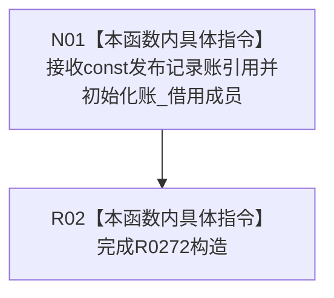

# CF-L7-0058 特征批次发布记录账访问器构造现状流程图

图类型：现状流程图
代码版本：`3920a74638264f9f539d50f32f3c9fe5fb1982ab`
源码 blob：`48a190d1d7ecf2264056b54dbc220ab57580a160`
覆盖文件：`海中鱼巣/领域/参与者.特征批次发布记录.ixx:189`
唯一根函数：R0272
完整签名：`explicit 海中鱼巣::特征批次发布记录账访问器::特征批次发布记录账访问器(const 海中鱼巣::特征批次发布记录账& 账)`
参数：发布记录账以 const 引用借用，生命周期必须覆盖访问器
返回结果：构造访问器并保存记录账 const 引用；构造函数无返回值
已登记调用方：F0404（RCE0202）
直接项目函数：无
外部边界：无；未解析项目调用：0
调用图：`流程图/主程序可达调用关系/01_main可达项目调用边表.md`
逐行映射表：`流程图/代码流程图/L7/CF-L7-0058_特征批次发布记录账访问器构造_逐行代码映射表.md`
偏差清单：无
依据：RCE0202 与冻结源码
结构读取与写入：只保存运行期借用引用
逻辑内返回：无
不得作为施工许可：是
不得宣称：发布记录账已有可读记录或已取得共享锁

## 流程图

## 当前边界

- 访问器不拥有发布记录账，也不在构造时读取记录。
