# CF-L7-0059 概念活动重建活动视图现状流程图

图类型：现状流程图
代码版本：`3920a74638264f9f539d50f32f3c9fe5fb1982ab`
源码 blob：`0a902454f56f7ee20e65f81ea6864e923a9c7f6a`
覆盖文件：`海中鱼巣/领域/数据操作.概念活动.ixx:131-184`
唯一根函数：R0331
完整签名：`海中鱼巣::概念活动重建结果 海中鱼巣::概念活动数据操作::重建活动视图(const 海中鱼巣::系统角色清单& 系统角色, const 海中鱼巣::概念活动初始化参数& 参数, const std::array<海中鱼巣::概念签名材料, 4>& 签名组) const`
参数：系统角色、初始化参数和四项签名组均为调用期只读引用
返回结果：完整读回时返回幂等读回及重建视图；入口无效返回默认结果；许可拒绝、版本漂移或内部不一致返回具名业务状态
已登记调用方：F0461、F0462
直接项目函数：RCE1050—RCE1058；RCE2718—RCE2724
外部边界：X02146、X03247—X03262
逐行映射表：`流程图/代码流程图/L7/CF-L7-0059_概念活动重建活动视图_逐行代码映射表.md`
依据：关系发布基线 `57c7ef1a4dc96083bd5ea570400c90cae5eaefc5` 与冻结源码
结构读写：在共享许可下只读状态、根身份、关系记录、关系审计和索引投影
不得作为施工许可：是
不得宣称：幂等读回改变了概念活动结构或重新发布了关系

## 流程图

```mermaid
flowchart TD
    C01["C01【函数调用】F0450/F0245/F0229/R0333复核入口材料<br/>RCE2718—RCE2720/RCE1050"]
    N02{"N02【本函数内具体指令】入口材料是否全部有效"}
    R03["R03【本函数内具体指令】返回默认重建结果"]
    N04["N04【本函数内具体指令】默认构造重建视图"]
    C05["C05【函数调用】F0231 读取三项稳定键组<br/>RCE1051"]
    N06["N06【本函数内具体指令】状态索引初始化为0"]
    C07["C07【函数调用】X03247读取键组大小"]
    N08{"N08【本函数内具体指令】是否还有状态键"}
    C09["C09【函数调用】X03248/X03249取得主键和阶段"]
    C10["C10【函数调用】R0407复核主键状态材料<br/>RCE1052"]
    N11{"N11【本函数内具体指令】状态完整且状态值等于阶段"}
    R12["R12【本函数内具体指令】返回版本漂移"]
    C13["C13【函数调用】R0334形成状态角色并经X03250写入数组<br/>RCE1053"]
    N14["N14【本函数内具体指令】状态索引递增"]
    C15["C15【函数调用】X03251共享许可函数指针调用F0397<br/>RCE2721"]
    C16["C16【函数调用】F0338检查许可有效<br/>RCE2722"]
    N17{"N17【本函数内具体指令】许可是否有效"}
    R18["R18【本函数内具体指令】返回许可拒绝"]
    C19["C19【函数调用】F0339读取令牌<br/>RCE1054"]
    C20["C20【函数调用】R0332读取根身份组<br/>RCE1055"]
    N21["N21【本函数内具体指令】根索引初始化为0"]
    C22["C22【函数调用】X03252读取根身份组大小"]
    N23{"N23【本函数内具体指令】是否还有概念根"}
    C24["C24【函数调用】X03253/X03254取得根身份和类别"]
    C25["C25【函数调用】R0338复核根身份<br/>RCE1056"]
    N26{"N26【本函数内具体指令】根身份是否一致"}
    C27["C27【函数调用】R0078读取概念生命周期关系组<br/>RCE1057"]
    C28["C28【函数调用】X03255/X03256检查唯一关系并读取记录"]
    N29{"N29【本函数内具体指令】关系数量及记录字段是否匹配"}
    N30["N30【本函数内具体指令】构造关系句柄"]
    C31["C31【函数调用】R0073读取关系审计<br/>RCE1058"]
    C32["C32【函数调用】X03258/X03259检查并读取关系审计"]
    N33{"N33【本函数内具体指令】审计编号、版本和状态是否匹配"}
    C34["C34【函数调用】X03250/X03253/X03260/X03261写入根材料"]
    C35["C35【函数调用】X03257/X03262释放关系组和审计optional"]
    N36["N36【本函数内具体指令】根索引递增"]
    C37["C37【函数调用】F0466检查重建视图完整<br/>RCE2723"]
    N38{"N38【本函数内具体指令】重建视图是否完整"}
    C39["C39【函数调用】X02146移动视图"]
    C40["C40【函数调用】F0345释放共享许可<br/>RCE2724"]
    R41["R41【本函数内具体指令】返回幂等读回结果"]
    R42["R42【本函数内具体指令】返回内部不一致"]

    C01 --> N02
    N02 -- 否 --> R03
    N02 -- 是 --> N04 --> C05 --> N06 --> C07 --> N08
    N08 -- 是 --> C09 --> C10 --> N11
    N11 -- 否 --> R12
    N11 -- 是 --> C13 --> N14 --> N08
    N08 -- 否 --> C15 --> C16 --> N17
    N17 -- 否 --> R18
    N17 -- 是 --> C19 --> C20 --> N21 --> C22 --> N23
    N23 -- 是 --> C24 --> C25 --> N26
    N26 -- 否 --> C40 --> R12
    N26 -- 是 --> C27 --> C28 --> N29
    N29 -- 否 --> C35 --> C40 --> R12
    N29 -- 是 --> N30 --> C31 --> C32 --> N33
    N33 -- 否 --> C35
    N33 -- 是 --> C34 --> C35 --> N36 --> N23
    N23 -- 否 --> C37 --> N38
    N38 -- 是 --> C39 --> C40 --> R41
    N38 -- 否 --> C40 --> R42
```

## 当前边界

- 状态、根身份、唯一生命周期关系或审计任一漂移均返回版本漂移。
- 共享许可只覆盖根关系和审计读取阶段，所有离开路径均调用 F0345。
