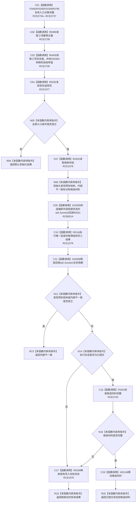

# CF-L7-0060 概念活动初始化全新活动现状流程图

图类型：现状流程图
代码版本：`3920a74638264f9f539d50f32f3c9fe5fb1982ab`
源码 blob：`0a902454f56f7ee20e65f81ea6864e923a9c7f6a`
覆盖文件：`海中鱼巣/领域/数据操作.概念活动.ixx:42-129`
唯一根函数：R0340
完整签名：`海中鱼巣::概念活动初始化结果 海中鱼巣::概念活动数据操作::初始化全新活动(const 海中鱼巣::系统角色清单& 系统角色, const 海中鱼巣::概念活动初始化参数& 参数, const 海中鱼巣::抽象状态写入规格& 活跃规格, const 海中鱼巣::抽象状态写入规格& 冷却规格, const 海中鱼巣::抽象状态写入规格& 退役规格, const std::array<海中鱼巣::概念签名材料, 4>& 签名组) const`
参数：系统角色、初始化参数、三项状态写入规格和四项签名组均为调用期只读引用
返回结果：入口无效返回默认结果；回调发现预存结构或内部不一致时返回内部不一致；执行未提交或候选不完整时映射结构失败状态；全部成功时返回已提交状态和移动后的候选材料
已登记调用方：F0462
直接项目函数：RCE1076—RCE1079；RCE2734—RCE2740
回调边界：RCB0014 → R0341
外部边界：X02148、X03304—X03306
逐行映射表：`流程图/代码流程图/L7/CF-L7-0060_概念活动初始化全新活动_逐行代码映射表.md`
依据：关系发布基线 `57c7ef1a4dc96083bd5ea570400c90cae5eaefc5` 与冻结源码
结构读写：外层只校验输入、形成捕获状态并委托结构写入执行器；真实结构写入由独立回调 R0341 执行
不得作为施工许可：是
不得宣称：执行器返回或候选材料存在即代表初始化已经提交

## 流程图

## 当前边界

- R0341 的 64—119 行回调业务体由独立单函数图 `CF-L9-0041` 覆盖，外层 R0340 不重复承担其写入节点。
- `发现预存结构` 与 `内部不一致` 优先于执行结果状态收口；任一成立均返回业务内部不一致。
