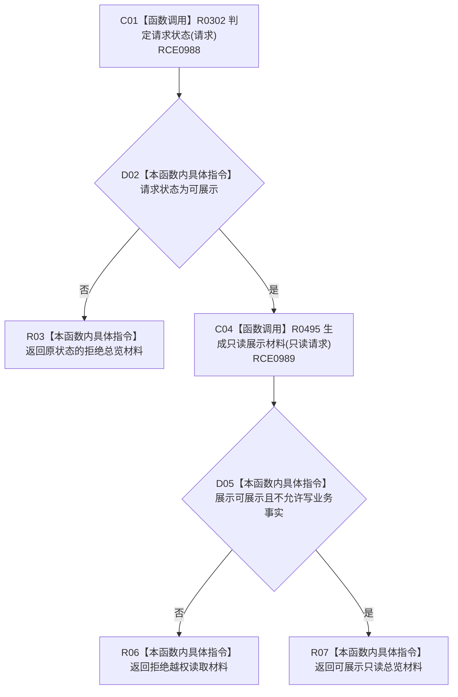

# CF-L7-0061 生成只读总览材料现状流程图

图类型：现状流程图
代码版本：`3920a74638264f9f539d50f32f3c9fe5fb1982ab`
源码 blob：`b0b4cdc2cd7e7fd6801f36c7a43bc27595ca89d9`
覆盖文件：`海中鱼巣/领域/控制面板服务.h:279-291`
唯一根函数：R0304
完整签名：`控制面板材料 海中鱼巣::控制面板服务::生成只读总览材料(const 控制面板请求& 请求) const`
参数：控制面板请求以 const 引用借用
返回结果：请求或展示材料门禁失败时返回对应拒绝材料；只读展示满足条件时返回可展示总览
已登记调用方：F0388（RCE0177）
直接项目函数：R0302（RCE0988）、R0495（RCE0989）
外部边界：无
逐行映射表：`流程图/代码流程图/L7/CF-L7-0061_生成只读总览材料_逐行代码映射表.md`
依据：冻结源码与既有项目边
结构读写：只构造返回材料，不写业务事实
不得作为施工许可：是
不得宣称：展示材料是数据库或机器事实裁决

## 流程图

## 当前边界

- 对显示服务的调用参数固定禁止业务写入；本函数不接受展示服务返回的写许可。
