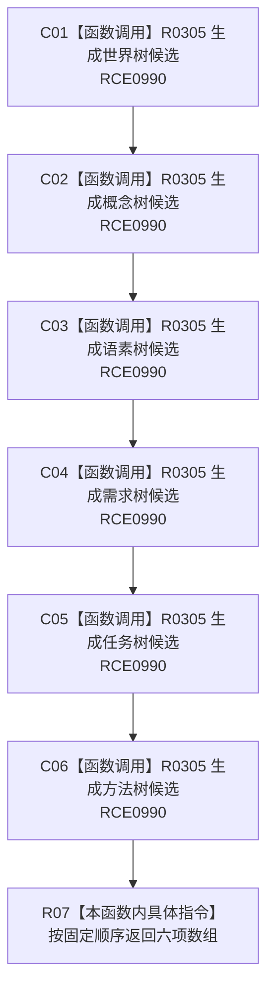

# CF-L7-0062 生成六类树视图候选材料现状流程图

图类型：现状流程图
代码版本：`3920a74638264f9f539d50f32f3c9fe5fb1982ab`
源码 blob：`b0b4cdc2cd7e7fd6801f36c7a43bc27595ca89d9`
覆盖文件：`海中鱼巣/领域/控制面板服务.h:300-309`
唯一根函数：R0306
完整签名：`std::array<控制面板树视图材料, 6> 海中鱼巣::控制面板服务::生成六类树视图候选材料() const`
参数：无显式参数
返回结果：按世界、概念、语素、需求、任务、方法固定顺序返回六项候选材料
已登记调用方：F0388（RCE0178）
直接项目函数：R0305（RCE0990，六处）
外部边界：无
逐行映射表：`流程图/代码流程图/L7/CF-L7-0062_生成六类树视图候选材料_逐行代码映射表.md`
依据：冻结源码与既有项目边
结构读写：无，只构造固定长度返回数组
不得作为施工许可：是
不得宣称：六项候选包含真实树内容

## 流程图

## 当前边界

- 固定数组不包含状态详情与动态详情两个拒绝分类。
